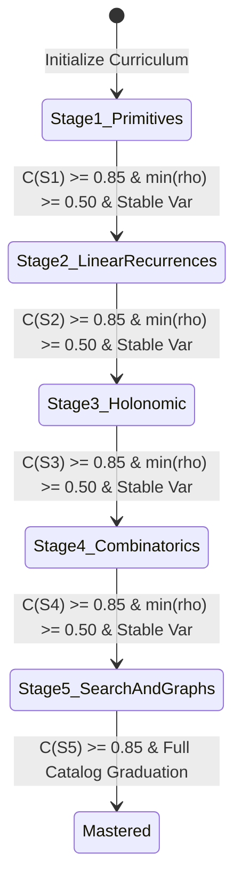
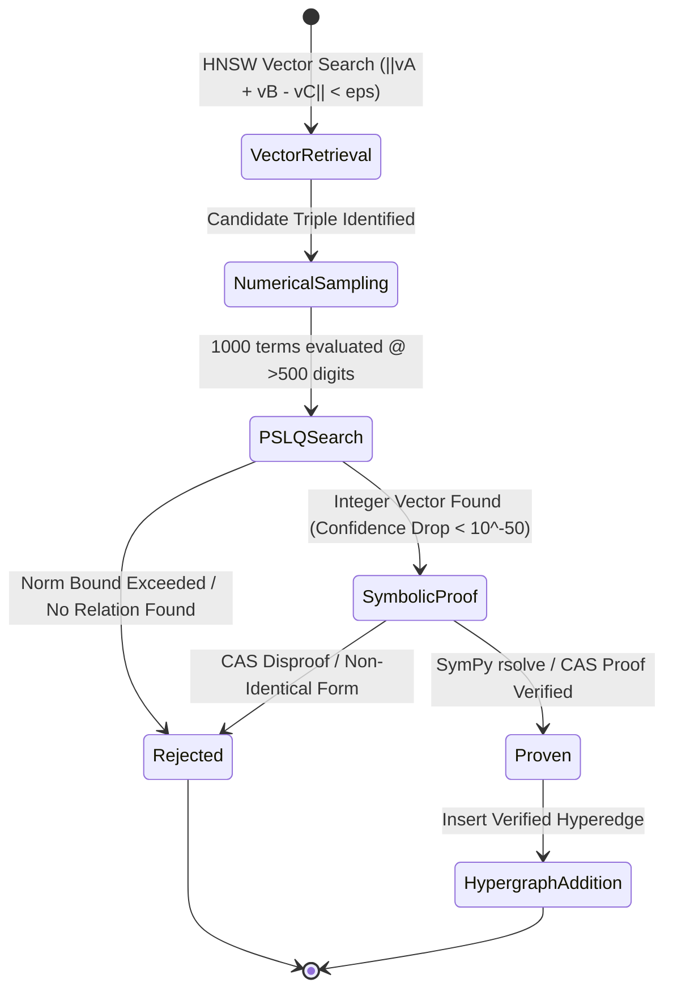

# Data Model: OEIS Learn Neuro-Symbolic Synthesis

**Feature**: [specs/001-oeis-neurosymbolic-synthesis/spec.md](specs/001-oeis-neurosymbolic-synthesis/spec.md)  
**Branch**: `001-oeis-neurosymbolic-synthesis`  
**Date**: 2026-08-30

---

## 1. Domain Entities & Schemas

### Entity: `SequenceRecord`
Represents an OEIS integer sequence entry ingested from `oeisdata` / `joeis`.

| Field | Type | Description | Validation Rules |
| :--- | :--- | :--- | :--- |
| `oeis_id` | `String` | Unique OEIS identifier (e.g., `"A000045"`) | Format `^A\d{6}$`, primary key |
| `name` | `String` | Formal mathematical title/description | Non-empty string |
| `terms` | `List[int]` | Ingested sequence terms (up to 200 terms) | Minimum 20 terms present |
| `tags` | `List[String]` | OEIS keywords (`core`, `easy`, `hard`, `nice`, `cons`, etc.) | Normalized lowercase string set |
| `curriculum_stage` | `int` | Assigned initial curriculum level ($1 \dots 5$) | Integer $\in [1, 5]$ derived from tags & jOEIS class |
| `joeis_class` | `Optional[String]` | Fully qualified Java class name in `joeis` (if present) | Valid Java class identifier |
| `generating_formula` | `Optional[String]` | Formal closed-form formula or recurrence formula (if known) | Mathematical string or null |
| `lz_complexity` | `float` | Lempel-Ziv compression size of the sequence string | Positive float |

---

### Entity: `TriStreamEmbedding`
Represents the continuous 3-axis neural representation of a sequence element $x_i$.

| Field | Type | Description | Validation Rules |
| :--- | :--- | :--- | :--- |
| `sequence_id` | `String` | Reference OEIS identifier | Valid `oeis_id` |
| `index` | `int` | Position index $n$ in the sequence | Non-negative integer ($0 \le n < N$) |
| `value` | `int` | Exact integer term $x_i$ | Unbounded integer ($\mathbb{Z}$) |
| `s1_magnitude` | `float` | Signed log-scale scalar $v_i = \text{sign}(x_i) \cdot (1 + \log_{10}(|x_i| + 1))$ | Finite FP32 float |
| `s2_modulo_spectrum` | `Tensor[float32, (200,)]` | 100 sine/cosine phase pairs across $m \in \{2, \dots, 101\}$ | All entries $\in [-1.0, 1.0]$ |
| `s3_differences` | `Tuple[float, float]` | Logarithmic first ($\Delta x_i$) and second ($\Delta^2 x_i$) differences | Finite FP32 floats |
| `s3_padic_valuations` | `Tensor[int64, (6,)]` | Valuations $v_p(x_i)$ for $p \in \{2, 3, 5, 7, 11, 13\}$ | Integers $\in [0, 16]$ |
| `unified_embedding` | `Tensor[float32, (d,)]` | Final fused embedding $Z_i \in \mathbb{R}^d$ after Hierarchical FiLM | Dimension $d \in \{256, 384, 768\}$, strict FP32 |

---

### Entity: `EnvironmentState`
Maintains lexical scope and stack depth during autoregressive grammar decoding.

| Field | Type | Description | Validation Rules |
| :--- | :--- | :--- | :--- |
| `declared_vars` | `Set[String]` | Local variable and parameter names declared in function scope | Non-empty after parameter header |
| `stack_depth` | `int` | Current height of the WASM operand stack | Must be $\ge 0$; binary ops require $\ge 2$ |
| `control_depth` | `int` | Current nesting level of `block`, `loop`, `if` constructs | Must be $\ge 0$; `br k` requires $k \le \text{control\_depth}$ |
| `active_tokens` | `List[int]` | Decoded token ID trajectory so far | Valid vocabulary indices |

---

### Entity: `CandidateProgram`
Represents a generated algorithmic candidate in WebAssembly Text format.

| Field | Type | Description | Validation Rules |
| :--- | :--- | :--- | :--- |
| `program_id` | `String` | Unique execution candidate UUID | Valid UUIDv4 |
| `prompt_oeis_id` | `String` | Target OEIS sequence identifier | Valid `oeis_id` |
| `wat_code` | `String` | Synthesized WebAssembly Text code | Valid WAT S-expression |
| `byte_size` | `int` | Compiled WASM binary byte size | Positive integer |
| `mdl_ratio` | `float` | Ratio of WASM byte size to Lempel-Ziv complexity ($M_{\text{MDL}}$) | Positive float |
| `extrapolation_passed` | `bool` | Whether program matched 100 extrapolated terms ($K=100$) | Boolean |

---

### Entity: `ExecutionResult`
Output returned from sandboxed WASM evaluation.

| Field | Type | Description | Validation Rules |
| :--- | :--- | :--- | :--- |
| `status` | `String` | Execution state | One of: `"SUCCESS"`, `"OUT_OF_FUEL"`, `"PARSE_ERROR"`, `"COMPILE_ERROR"`, `"EXECUTION_TRAP"`, `"MISSING_ENTRYPOINT"` |
| `consumed_fuel` | `int` | Instruction fuel consumed | $0 \le \text{consumed\_fuel} \le 10,000$ |
| `output` | `List[int]` | Generated sequence terms ($n = 0 \dots N-1$) | Array of 64-bit integers |
| `error` | `Optional[String]` | Error or trap message (if failed) | String or null |
| `divergence_step` | `Optional[int]` | Index $n$ where output first deviated from target sequence | Non-negative integer or null |

---

### Entity: `CurriculumProgress`
Maintains state for the 5-stage automated curriculum scheduler.

| Field | Type | Description | Validation Rules |
| :--- | :--- | :--- | :--- |
| `active_stage` | `int` | Current active curriculum stage ($1 \dots 5$) | Integer $\in [1, 5]$ |
| `rolling_pass_rates` | `Dict[String, float]` | Windowed pass-rate $\hat{\rho}_x$ per sequence prompt ($W=20$) | Floats $\in [0.0, 1.0]$ |
| `stage_competence` | `float` | Weighted mean competence score $C(S_k)$ | Float $\in [0.0, 1.0]$ |
| `coverage_min` | `float` | Minimum prompt pass-rate in active stage $\min(\hat{\rho}_x)$ | Float $\in [0.0, 1.0]$ |
| `epoch_variance` | `float` | Variance of competence across recent epochs $\mathbb{Var}[C_e]$ | Non-negative float |
| `graduated_stages` | `List[int]` | List of stages successfully graduated | Subset of $\{1, 2, 3, 4, 5\}$ |

---

### Entity: `LatentDiscoveryCandidate`
Represents an algebraic conjecture discovered in latent representation space.

| Field | Type | Description | Validation Rules |
| :--- | :--- | :--- | :--- |
| `candidate_id` | `String` | Unique conjecture UUID | Valid UUIDv4 |
| `relation_type` | `String` | Conjectured algebraic form (`"LINEAR_SUM"`, `"CAUCHY_CONV"`, `"BINOMIAL_PAIR"`) | Recognized relation type enum |
| `sequences` | `Tuple[String, ...]` | Participating OEIS sequence IDs (e.g., `(A000045, A000032, A000213)`) | Valid `oeis_id` references |
| `vector_distance` | `float` | Euclidean distance in latent space $\|\sum c_i \vec{v}_i\|_2$ | Float $< \epsilon_{\text{geom}}$ |
| `pslq_vector` | `Optional[List[int]]` | Integer relation vector $a \in \mathbb{Z}^k$ | Non-zero integer vector or null |
| `pslq_confidence_ratio` | `Optional[float]` | Ratio $\min_i |y_i| / \max_i |y_i|$ | Float $< 10^{-50}$ for confirmed relations |
| `symbolic_proof` | `Optional[String]` | SymPy / SageMath generated proof script | Non-empty string or null |
| `status` | `String` | Verification status | One of: `"CONJECTURED"`, `"PSLQ_VERIFIED"`, `"PROVEN"`, `"REJECTED"` |

---

## 2. State Transition Diagrams

### Curriculum Stage Progression State Flow

### Discovery Pipeline Verification State Flow

