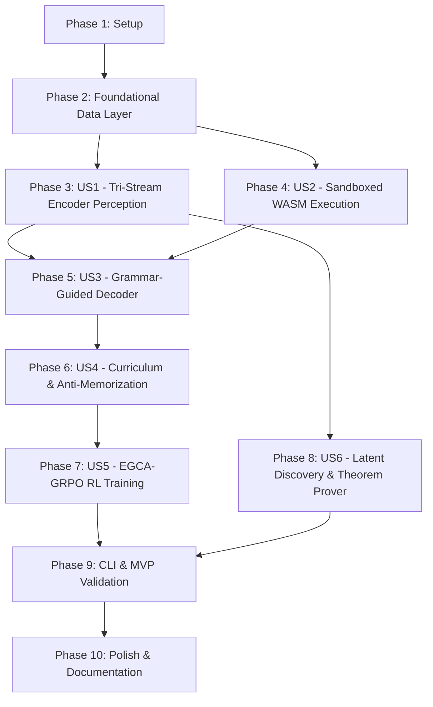

# Tasks: OEIS Learn Neuro-Symbolic Synthesis

**Input**: Design documents from [specs/001-oeis-neurosymbolic-synthesis/](specs/001-oeis-neurosymbolic-synthesis/)  
**Prerequisites**: [plan.md](specs/001-oeis-neurosymbolic-synthesis/plan.md), [spec.md](specs/001-oeis-neurosymbolic-synthesis/spec.md), [research.md](specs/001-oeis-neurosymbolic-synthesis/research.md), [data-model.md](specs/001-oeis-neurosymbolic-synthesis/data-model.md), [contracts/](specs/001-oeis-neurosymbolic-synthesis/contracts/), [quickstart.md](specs/001-oeis-neurosymbolic-synthesis/quickstart.md), [.specify/memory/constitution.md](.specify/memory/constitution.md)

**Tests**: Test-Driven Development (TDD) tasks are included for all foundational components, numerical invariants, and user stories per Constitution Quality Gate 1.

**Organization**: Tasks are grouped by user story (US1 through US6) following priority order from the specification to enable modular, testable, and parallelizable implementation.

---

## Format: `[ID] [P?] [Story] Description`
- **[P]**: Can run in parallel (different files, no direct dependency on incomplete tasks)
- **[Story]**: Target user story identifier (`[US1]` through `[US6]`)
- Every task includes an explicit, actionable description with specific file paths.

---

## Phase 1: Setup (Shared Infrastructure & Environment)

**Purpose**: Establish repository structure, configuration files, build systems, and virtual environments.

- [X] T001 Create project folder structure (`src/oeis_learn/{data,encoder,decoder,sandbox,rl,curriculum,discovery,cli}`, `crates/oeis_wasm_evaluator/src`, `configs/`, `tests/{unit,integration,contract}`, `data/`, `reports/`) per implementation plan
- [X] T002 [P] Initialize Python packaging in `pyproject.toml` with dependencies (`torch>=2.3.0`, `duckdb>=0.10.0`, `mpmath>=1.3.0`, `sympy>=1.12`, `llguidance`, `cuml`, `pytest`, `pytest-benchmark`, `maturin>=1.4.0`)
- [X] T003 [P] Initialize Rust PyO3 crate manifest in `crates/oeis_wasm_evaluator/Cargo.toml` with dependencies (`pyo3="0.20"`, `wasmtime="20.0"`, `wat="1.0"`, `rayon="1.8"`, `crate-type=["cdylib"]`)
- [X] T004 [P] Create Tier 1 local workstation training configuration in `configs/train_tier1.yaml` ($d=256$, batch size 4–8, 8 CPU threads, strict FP32, fuel limit 10,000)
- [X] T005 [P] Create Tier 2 cluster scale-up training configuration in `configs/train_tier2.yaml` ($d=768$, multi-GPU DDP, full 390,000+ OEIS database)
- [X] T006 [P] Configure code style, linting, and formatting tools in `pyproject.toml` (`ruff`, `black`, `isort`, `mypy`) and `rustfmt.toml`

---

## Phase 2: Foundational (Blocking Prerequisites & Local Storage)

**Purpose**: Implement shared core infrastructure, database schemas, and baseline data ingestion before implementing neural components.

- [X] T007 Initialize local DuckDB/SQLite schema and table creation scripts in `src/oeis_learn/data/schema.py` based on `specs/001-oeis-neurosymbolic-synthesis/contracts/database-schema.sql`
- [X] T008 [P] Implement OEIS sequence record data models and metadata parsers in `src/oeis_learn/data/models.py` (parsing `oeisdata` stripped files and `joeis` class maps)
- [X] T009 Implement DuckDB data ingestion and indexing pipeline in `src/oeis_learn/data/ingest.py` supporting curriculum stage tagging and sequence filtering
- [X] T010 [P] Implement Lempel-Ziv complexity computation and sequence string compression utilities in `src/oeis_learn/data/lz_complexity.py`
- [X] T011 Implement PyTorch Dataset and batch collator in `src/oeis_learn/data/dataset.py` supporting variable sequence length padding and Stage 1/Stage 2 subset filtering
- [X] T012 [P] Write integration tests for data ingestion, DuckDB querying, and LZ complexity calculation in `tests/integration/test_data_ingestion.py`

**Checkpoint**: Core data layer ready and validated via tests.

---

## Phase 3: User Story 1 - Exact Multi-Axis Integer Ingestion & Representation (Priority: P1) 🎯 MVP Perception

**Goal**: Ingest integer sequences and represent extreme values ($-10^6$ to $10^{30}$) along orthogonal axes ($S_1$ magnitude, $S_2$ 100-moduli Fourier spectrum, $S_3$ finite differences + $p$-adics) in strict FP32 without OOV errors or precision collapse.

**Independent Test**: Run `pytest tests/unit/test_tri_stream_encoder.py` to verify 1,000 benchmark sequences spanning dynamic ranges from $-10^6$ to $10^{30}$ encode with 0 NaN/Inf values under strict FP32 precision.

### Tests for User Story 1 (TDD)
- [X] T013 [P] [US1] Unit test for Magnitude Stream ($S_1$) signed logarithmic scaling in `tests/unit/test_magnitude_stream.py`
- [X] T014 [P] [US1] Unit test for Modulo-Spectrum Stream ($S_2$) Fourier phase vectors across 100 moduli in `tests/unit/test_modulo_stream.py`
- [X] T015 [P] [US1] Unit test for Difference & $p$-Adic Stream ($S_3$) finite differences and $p$-adic valuations ($p \le 13$) in `tests/unit/test_difference_stream.py`
- [X] T016 [P] [US1] Unit test for Hierarchical Two-Stage FiLM Fusion block in `tests/unit/test_film_fusion.py`
- [X] T017 [US1] End-to-end numerical stability test for Tri-Stream Encoder processing 1,000 sequences in `tests/unit/test_tri_stream_encoder.py`

### Implementation for User Story 1
- [X] T018 [P] [US1] Implement Magnitude Stream ($S_1$) in `src/oeis_learn/encoder/magnitude_stream.py` with signed continuous log transformation $v_i = \text{sign}(x_i) \cdot (1 + \log_{10}(|x_i| + 1))$ and 2-layer GELU MLP
- [X] T019 [P] [US1] Implement Modulo-Spectrum Stream ($S_2$) in `src/oeis_learn/encoder/modulo_stream.py` computing 200D Fourier phase embeddings $\mathbf{\Phi}_i = \bigoplus_{m=2}^{101} [\sin(2\pi(x_i \bmod m)/m), \cos(2\pi(x_i \bmod m)/m)]$ projected to $\mathbb{R}^d$
- [X] T020 [P] [US1] Implement Difference and $p$-Adic Stream ($S_3$) in `src/oeis_learn/encoder/difference_stream.py` computing $\Delta x_i$, $\Delta^2 x_i$, and learned ordinal embeddings for $v_p(x_i)$ ($p \in \{2, 3, 5, 7, 11, 13\}$, $k_{\max}=16$)
- [X] T021 [US1] Implement Hierarchical Two-Stage FiLM Fusion in `src/oeis_learn/encoder/film_fusion.py` ($S_2$ modulates $S_1$ to form $H_{12}$; $S_3$ modulates $H_{12}$ to yield $Z_i$)
- [X] T022 [US1] Implement unified Bidirectional Transformer Encoder backbone in `src/oeis_learn/encoder/tri_stream_encoder.py` with strict FP32 assertions and no-AMP enforcement
- [X] T023 [US1] Implement auxiliary prediction heads (magnitude MSE, sign CE, 100-moduli CE) in `src/oeis_learn/encoder/heads.py` for pre-training supervision

**Checkpoint**: User Story 1 complete and fully verified under unit and numerical tests.

---

## Phase 4: User Story 2 - Deterministic Sandboxed Program Execution & Fuel Bounding (Priority: P1) 🎯 MVP Execution

**Goal**: Provide in-memory WAT compilation, deterministic 10,000-fuel metering, 16 MiB linear memory limits, and GIL-free multi-threaded batch evaluation across 8 CPU threads via a native Rust PyO3 extension.

**Independent Test**: Run `pytest tests/unit/test_wasm_sandbox.py` and `pytest tests/integration/test_batch_throughput.py` to confirm infinite loops trap in $<1\,\text{ms}$ within 10,000 fuel units and throughput exceeds 500 evaluations/sec across 8 CPU threads.

### Tests for User Story 2 (TDD)
- [X] T024 [P] [US2] Rust unit tests for in-memory parsing, fuel consumption accounting, and runtime trap handling in `crates/oeis_wasm_evaluator/src/sandbox.rs`
- [X] T025 [P] [US2] Python FFI contract test verifying `evaluate_wat_batch` and `evaluate_wat_single` in `tests/contract/test_ffi_contract.py`
- [X] T026 [P] [US2] Python unit tests for fuel limits, linear memory ceilings, and error classification in `tests/unit/test_wasm_sandbox.py`
- [X] T027 [US2] Multi-threaded Rayon throughput benchmark test in `tests/integration/test_batch_throughput.py`

### Implementation for User Story 2
- [X] T028 [P] [US2] Implement thread-safe Wasmtime engine configuration with Cranelift fuel metering in `crates/oeis_wasm_evaluator/src/engine.rs`
- [X] T029 [US2] Implement in-memory WAT compilation (`wat::parse_str`), linear memory bounds (16 MiB), fuel injection (10,000), and sequence evaluation loop in `crates/oeis_wasm_evaluator/src/sandbox.rs`
- [X] T030 [US2] Implement PyO3 module bindings, `ExecutionResult` struct, and GIL-free parallel batch evaluator (`py.allow_threads` + `rayon::par_iter`) in `crates/oeis_wasm_evaluator/src/lib.rs`
- [X] T031 [US2] Build and package native extension using `maturin` and create Python sandbox wrapper in `src/oeis_learn/sandbox/runner.py`
- [X] T032 [US2] Implement fallback in-memory Python evaluation using `wasmtime-py` with equivalent 10,000 fuel limits in `src/oeis_learn/sandbox/fallback_runner.py`

**Checkpoint**: User Stories 1 and 2 deliver an end-to-end perception and execution MVP.

---

## Phase 5: User Story 3 - Syntactically & Semantically Sound Grammar-Guided Synthesis (Priority: P2)

**Goal**: Generate WebAssembly Text (WAT) S-expressions autoregressively using `llguidance` / `XGrammar-2` with Environment-Indexed Grammars ($\mathcal{G}_{\Gamma_t}$) tracking local variables and stack depths to guarantee 100% syntactically valid code and No-Ghost Soundness.

**Independent Test**: Generate 1,000 candidate programs under grammar constraints; verify via `pytest tests/unit/test_grammar_masker.py` that 100% assemble into valid WASM binaries with 0 syntax or unbound identifier errors.

### Tests for User Story 3 (TDD)
- [X] T033 [P] [US3] Grammar contract test validating EBNF specification in `tests/contract/test_wat_grammar_contract.py`
- [X] T034 [P] [US3] Unit test for Environment Tracker ($\text{Vars}_t, \text{Types}_t, \text{Depth}_t$) in `tests/unit/test_environment_tracker.py`
- [X] T035 [US3] Unit test for dynamic Earley trie logit masking and sub-$100\,\mu\text{s}$ latency in `tests/unit/test_grammar_masker.py`

### Implementation for User Story 3
- [X] T036 [P] [US3] Implement WAT EBNF grammar definitions and token trie mappings in `src/oeis_learn/decoder/wat_grammar.py` based on `specs/001-oeis-neurosymbolic-synthesis/contracts/wat-grammar.ebnf`
- [X] T037 [P] [US3] Implement dynamic Environment State Tracker ($\text{Vars}_t$, operand stack depth, block nesting depth) in `src/oeis_learn/decoder/environment_tracker.py`
- [X] T038 [US3] Implement `llguidance` / `XGrammar-2` integration and dynamic logit mask generator in `src/oeis_learn/decoder/grammar_masker.py`
- [X] T039 [US3] Implement Autoregressive Transformer Decoder conditioning on latent sequence embeddings $Z$ with cross-attention in `src/oeis_learn/decoder/wat_decoder.py`
- [X] T040 [US3] Implement token generation sampling pipeline with Environment-Indexed mask application in `src/oeis_learn/decoder/sampler.py`

**Checkpoint**: Grammar-guided decoder reliably synthesizes syntactically valid, semantically sound WAT code.

---

## Phase 6: User Story 4 - Taxonomy-Aligned Curriculum Progression & Anti-Memorization Verification (Priority: P2)

**Goal**: Implement a 5-stage taxonomy-aligned curriculum scheduler with automated graduation gates ($C(S_k) \ge 0.85$, $\min(\hat{\rho}_x) \ge 0.50$), $N+K$ ($K=100$) extrapolation horizon testing, and Minimum Description Length ($M_{\text{MDL}} \le 1.2$) anti-memorization verification.

**Independent Test**: Run `pytest tests/unit/test_curriculum_gates.py` to verify automated graduation triggers and rejection of over-fitted lookup table programs via $M_{\text{MDL}}$ and extrapolation checks.

### Tests for User Story 4 (TDD)
- [X] T041 [P] [US4] Unit test for rolling competence calculation and graduation criteria in `tests/unit/test_curriculum_scheduler.py`
- [X] T042 [P] [US4] Unit test for Extrapolation Horizon ($N+K$, $K=100$) verification in `tests/unit/test_extrapolation_verifier.py`
- [X] T043 [P] [US4] Unit test for Minimum Description Length ($M_{\text{MDL}} \le 1.2$) complexity validation in `tests/unit/test_mdl_verifier.py`
- [X] T044 [US4] Integration test for dynamic mixture prompt sampling (70% new stage, 20% previous, 10% earlier) in `tests/unit/test_curriculum_gates.py`

### Implementation for User Story 4
- [X] T045 [P] [US4] Implement 5-stage taxonomy tag mapper and difficulty weighting in `src/oeis_learn/curriculum/taxonomy.py`
- [X] T046 [P] [US4] Implement Extrapolation Horizon ($N+K$ terms, $N=20, K=100$) verifier in `src/oeis_learn/curriculum/extrapolation.py`
- [X] T047 [P] [US4] Implement Minimum Description Length ($M_{\text{MDL}}$) ratio verifier against sequence Lempel-Ziv complexity in `src/oeis_learn/curriculum/mdl_verifier.py`
- [X] T048 [US4] Implement Rolling Task Competence $C(S_k)$ tracker and graduation gating logic in `src/oeis_learn/curriculum/scheduler.py`
- [X] T049 [US4] Implement dynamic mixture prompt sampler in `src/oeis_learn/curriculum/sampler.py` to prevent catastrophic forgetting across stage transitions

**Checkpoint**: Curriculum pipeline autonomously manages learning progression and prevents memorization.

---

## Phase 7: User Story 5 - Localized Execution-Guided Credit Assignment (EGCA) RL (Priority: P3)

**Goal**: Train the program synthesis policy using Execution-Guided Credit Assignment GRPO (EGCA-GRPO) with asymmetric prompt weighting under exact binary outcome rewards ($\pm 1$), localizing gradient updates to instruction tokens active during execution divergence.

**Independent Test**: Run `pytest tests/integration/test_egca_training_step.py` to verify that rollout groups with 0% initial success receive non-zero negative gradients concentrated on execution divergence windows.

### Tests for User Story 5 (TDD)
- [X] T050 [P] [US5] Unit test for binary outcome reward ($\pm 1$) evaluation in `tests/unit/test_reward_evaluator.py`
- [X] T051 [P] [US5] Unit test for execution trace divergence step locator in `tests/unit/test_execution_tracer.py`
- [X] T052 [P] [US5] Unit test for asymmetric prompt weighting in group relative policy updates in `tests/unit/test_prompt_weighting.py`
- [X] T053 [US5] Integration test for complete EGCA-GRPO training iteration in `tests/integration/test_egca_training_step.py`

### Implementation for User Story 5
- [X] T054 [P] [US5] Implement strict binary outcome reward function ($+1$ for exact $N$-term match, $-1$ otherwise) in `src/oeis_learn/rl/reward.py`
- [X] T055 [P] [US5] Implement Execution Tracer recording stack and variable states to pinpoint the divergence token index $n_{\text{diverge}}$ in `src/oeis_learn/sandbox/tracer.py`
- [X] T056 [US5] Implement Asymmetric Prompt Weighting for failed rollout groups ($R_i = -1, \forall i$) in `src/oeis_learn/rl/prompt_weighting.py`
- [X] T057 [US5] Implement Execution-Guided Credit Assignment GRPO (EGCA-GRPO) loss function and localized gradient masking in `src/oeis_learn/rl/egca_grpo.py`
- [X] T058 [US5] Implement end-to-end RL training loop coordinating batch sampling, Rayon execution, EGCA loss calculation, and AdamW optimization in `src/oeis_learn/rl/trainer.py`

**Checkpoint**: Reinforcement learning engine efficiently trains policy without zero-advantage collapse.

---

## Phase 8: User Story 6 - Latent Space Geometry & Automated Mathematical Relation Discovery (Priority: P3)

**Goal**: Map sequences into continuous latent space using non-contrastive VICReg, cluster high-dimensional embeddings via cuML UMAP/HDBSCAN, and verify candidate relations ($\vec{v}_A + \vec{v}_B \approx \vec{v}_C$) via high-precision `mpmath` sampling, PSLQ integer relations ($<10^{-50}$ confidence drop), and SymPy proofs.

**Independent Test**: Run `pytest tests/integration/test_discovery_pipeline.py` to extract latent vector triples, confirm integer relations with PSLQ, and generate machine-verified symbolic proofs in SymPy.

### Tests for User Story 6 (TDD)
- [X] T059 [P] [US6] Unit test for algebraic transformation pair generation ($\mathcal{S}, \Delta, \mathcal{B}, \mathcal{E}, \mathcal{T}_k$) in `tests/unit/test_algebraic_transforms.py`
- [X] T060 [P] [US6] Unit test for non-contrastive VICReg loss (variance, invariance, covariance) in `tests/unit/test_vicreg_loss.py`
- [X] T061 [P] [US6] Unit test for arbitrary-precision numerical sampling ($>500$ digits) and PSLQ integer relation solver in `tests/unit/test_pslq_solver.py`
- [X] T062 [P] [US6] Unit test for SymPy symbolic recurrence solving and identity proof in `tests/unit/test_symbolic_prover.py`
- [X] T063 [US6] Integration test for complete discovery pipeline ($\text{Vector Arithmetic} \rightarrow \text{PSLQ} \rightarrow \text{Proof}$) in `tests/integration/test_discovery_pipeline.py`

### Implementation for User Story 6
- [X] T064 [P] [US6] Implement deterministic algebraic sequence transformations (partial sums, first differences, binomial transforms, shift operators) in `src/oeis_learn/data/transforms.py`
- [X] T065 [P] [US6] Implement non-contrastive VICReg loss function (MSE invariance, variance hinge, covariance decorrelation) in `src/oeis_learn/discovery/vicreg_loss.py`
- [X] T066 [P] [US6] Implement GPU-accelerated cuML UMAP manifold reduction and HDBSCAN density clustering in `src/oeis_learn/discovery/manifold.py`
- [X] T067 [US6] Implement HNSW vector arithmetic search for candidate relation triples ($\|\vec{v}_A + \vec{v}_B - \vec{v}_C\|_2 < \epsilon$) in `src/oeis_learn/discovery/vector_search.py`
- [X] T068 [US6] Implement high-precision `mpmath` sequence sampling and PSLQ integer relation solver with confidence drop validation ($<10^{-50}$) in `src/oeis_learn/discovery/pslq_solver.py`
- [X] T069 [US6] Implement symbolic proof generator and computer algebra verifier using `sympy.rsolve` and generating function identities in `src/oeis_learn/discovery/symbolic_prover.py`

**Checkpoint**: Automated discovery pipeline autonomously discovers and proves mathematical sequence theorems.

---

## Phase 9: CLI Interface, Benchmarking & MVP Validation

**Purpose**: Build the unified command-line tool, benchmark suites, and execute quickstart validation scenarios.

- [X] T070 [P] Implement CLI argument parsing and commands (`ingest`, `train`, `synthesize`, `discover`) in `src/oeis_learn/cli/main.py` per `specs/001-oeis-neurosymbolic-synthesis/contracts/cli-interface.contract.json`
- [X] T071 [P] Implement CLI contract validation test in `tests/contract/test_cli_contract.py`
- [X] T072 Implement benchmark logging, execution metrics reporting, and proof summary export in `src/oeis_learn/cli/reporting.py`
- [X] T073 Execute end-to-end validation scenarios 1 through 6 from `specs/001-oeis-neurosymbolic-synthesis/quickstart.md`
- [X] T074 [P] Validate Tier 1 local workstation resource constraints (GPU memory $<4\,\text{GB}$, 8 CPU threads utilization) and document performance in `reports/tier1_baseline_report.md`

---

## Phase 10: Polish & Cross-Cutting Concerns

**Purpose**: Final documentation, code hygiene, license headers, and developer onboarding.

- [X] T075 [P] Update `README.md` with installation guides, architectural diagrams, and CLI examples
- [X] T076 [P] Add type annotations and run strict `mypy` checks across `src/oeis_learn/`
- [X] T077 Run full test suite (`pytest` + `cargo test`) and generate coverage report ensuring $>90\%$ code coverage

---

## Dependencies & Execution Order

### Phase Dependencies

### User Story Dependencies & Parallel Execution Opportunities

- **US1 (Perception)** and **US2 (Execution)** can be developed in parallel once Phase 2 (Foundational) is complete.
- **US3 (Grammar Decoder)** requires both US1 (latent embeddings $Z$) and US2 (WASM runtime compilation).
- **US4 (Curriculum)** builds upon US2 and US3 to evaluate stage pass-rates and extrapolation.
- **US5 (RL Training)** connects US1, US2, US3, and US4 into a closed training loop with EGCA credit assignment.
- **US6 (Latent Discovery)** can be developed in parallel with US3/US4/US5 once US1 (Tri-Stream Encoder) is complete.

---

## Implementation Strategy & MVP Milestone

1. **MVP Milestone 1 (Perception & Execution Foundation - Phases 1 to 4)**:
   - Deliver `TriStreamEncoder` in FP32 + native Rust `oeis_wasm_evaluator` with 10,000 fuel limits.
   - Proves zero-crash deterministic execution ($>500$ evals/sec) and numerical stability across large integers.
2. **MVP Milestone 2 (Synthesizer & Curriculum - Phases 5 to 7)**:
   - Deliver `llguidance` grammar masking, Environment-Indexed scope tracking, and EGCA-GRPO training loop.
   - Achieve $\ge 80\%$ pass rate on Curriculum Stage 1 (polynomials) under Tier 1 workstation constraints.
3. **MVP Milestone 3 (Automated Discovery - Phase 8)**:
   - Deliver VICReg self-supervision, PSLQ integer relation searches, and SymPy automated proof generation.
