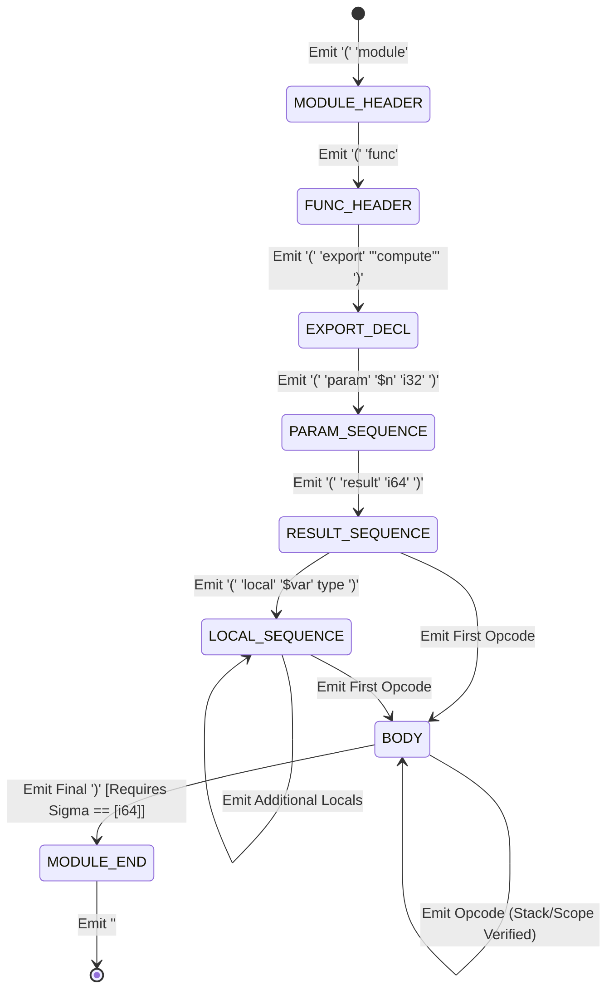
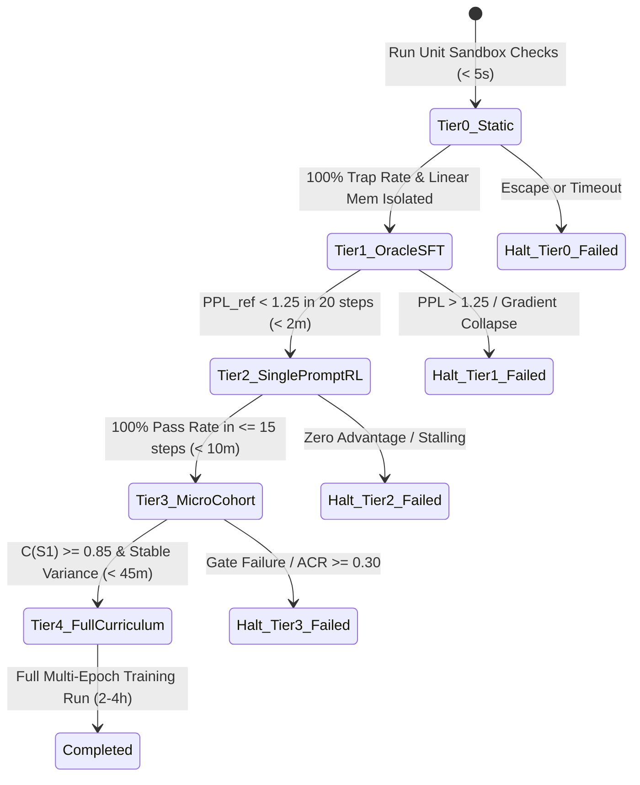
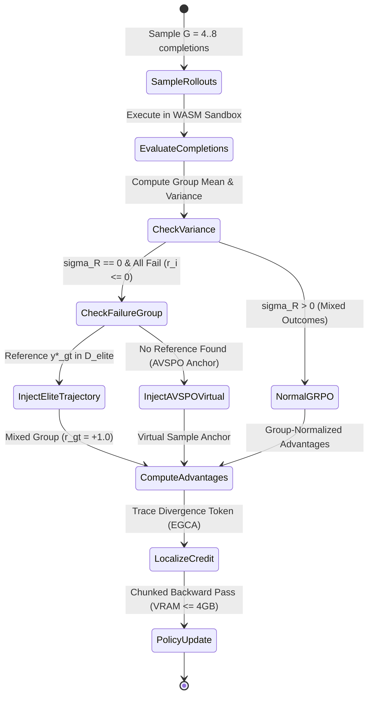

# Data Model: Synthesis Bootstrapping, Semantic Soundness & Progressive Optimization

**Feature**: [specs/002-synthesis-bootstrapping-and-soundness/spec.md](specs/002-synthesis-bootstrapping-and-soundness/spec.md)  
**Branch**: `002-synthesis-bootstrapping-and-soundness`  
**Date**: 2026-08-31

---

## 1. Domain Entities & Schemas

### Entity: `DynamicEnvironmentState`
Maintains the complete online state tuple $S_t = \langle \Phi_t, \Gamma_t, \Sigma_t, H_t \rangle$ during autoregressive WebAssembly Text token generation.

| Field | Type | Description | Validation Rules |
| :--- | :--- | :--- | :--- |
| `phase` | `StructuralPhase` | Current structural decoding phase ($\Phi_t$) | One of: `MODULE_HEADER`, `FUNC_HEADER`, `EXPORT_DECL`, `PARAM_SEQUENCE`, `RESULT_SEQUENCE`, `LOCAL_SEQUENCE`, `BODY`, `MODULE_END` |
| `declared_vars` | `Dict[String, ValType]` | In-scope identifiers and their formal value types ($\Gamma_t$) | Keys must start with `$`; types $\in \{\text{i32}, \text{i64}\}$ |
| `operand_stack` | `List[ValType]` | Pushdown operand type stack ($\Sigma_t$) | Elements $\in \{\text{i32}, \text{i64}\}$; maximum depth 256 |
| `control_stack` | `List[ControlFrame]` | Pushdown control block nesting frames ($H_t$) | Maximum depth 64; each frame records block kind, label, baseline stack height |
| `paren_depth` | `int` | Parenthesis nesting depth | Must be $\ge 0$; final state must reach $0$ |
| `active_tokens` | `List[int]` | Decoded token ID trajectory so far | Valid vocabulary indices ($0 \le \text{id} < \vert V\vert$) |

---

### Entity: `SyntheticDemonstrationPair`
Represents a forward-generated synthetic training instance mapping an integer sequence to a valid WebAssembly program.

| Field | Type | Description | Validation Rules |
| :--- | :--- | :--- | :--- |
| `sample_id` | `String` | Unique synthetic instance identifier | Format `^SYNTH_[A-Z0-9_-]+$` |
| `family` | `String` | Algorithmic generator family | One of: `POLYNOMIAL_LINEAR`, `POLYNOMIAL_QUADRATIC`, `POLYNOMIAL_CUBIC`, `RECURRENCE_ORDER1`, `RECURRENCE_FIBONACCI`, `MODULAR_PERIODIC`, `FACTORIAL_LOOP` |
| `terms` | `List[int]` | Executed output terms for $n = 0 \dots N-1$ ($N \ge 20$) | Minimum 20 integer terms, no overflow |
| `wat_code` | `String` | Complete, compilable WebAssembly Text source | 100% valid WAT; compiles without error |
| `byte_size` | `int` | Compiled WASM binary size in bytes | Positive integer |
| `lz_complexity` | `float` | Lempel-Ziv compression size of the term sequence | Positive float |
| `metadata` | `Dict[String, Any]` | Generator parameters (coefficients, initial values) | Valid JSON object |

---

### Entity: `EliteReplayBufferEntry`
Represents a verified canonical reference solution stored in the elite demonstration buffer $\mathcal{D}_{\text{elite}}$.

| Field | Type | Description | Validation Rules |
| :--- | :--- | :--- | :--- |
| `oeis_id` | `String` | Reference OEIS identifier (e.g., `"A000217"`) | Format `^A\d{6}$`, primary key |
| `terms` | `List[int]` | Sequence terms used for prompt generation | Minimum 20 terms |
| `wat_code` | `String` | Canonical generating WebAssembly program | Valid WAT, 100% exact match |
| `byte_size` | `int` | Compiled binary byte size | Positive integer |
| `extrapolation_passed` | `bool` | Whether solution matches $K=100$ future terms | Strictly `True` |
| `mdl_ratio` | `float` | Minimum Description Length ratio ($M_{\text{MDL}}$) | Must be $\le 1.20$ |
| `source` | `String` | Provenance of solution | One of: `SYNTHETIC_GENERATOR`, `SYMBOLIC_SEARCH`, `SFT_WARMUP`, `ONLINE_DISCOVERY` |

---

### Entity: `DiagnosticTelemetryRecord`
Captures point-in-time RL optimization dynamics and early warning indicators.

| Field | Type | Description | Validation Rules |
| :--- | :--- | :--- | :--- |
| `epoch` | `int` | Current training epoch | Non-negative integer |
| `step` | `int` | Global optimization step | Non-negative integer |
| `policy_entropy` | `float` | Token probability distribution entropy $\mathcal{H}(\pi_\theta)$ | Bounded float; warn if $< 0.20$ |
| `reward_variance` | `float` | Intra-group reward variance $\sigma_R^2$ | Non-negative float; warn if $0.00$ |
| `advantage_collapse_rate` | `float` | Sliding-window Advantage Collapse Rate ($\text{ACR}$) | Float $\in [0.0, 1.0]$; warn if $\ge 0.30$ |
| `compiler_trap_rate` | `float` | Percentage of rollouts failing compilation | Float $\in [0.0, 1.0]$; target $< 0.05$ |
| `avg_prefix_length` | `float` | Mean output prefix match length $\bar{L}_{\text{prefix}}$ | Float $\in [0.0, N]$ |
| `oracle_ppl` | `Optional[float]` | Perplexity on canonical reference solutions | Positive float or null; target $< 1.30$ |
| `active_stage` | `int` | Current curriculum stage ($1 \dots 5$) | Integer $\in [1, 5]$ |

---

### Entity: `ProgressiveTierResult`
Records the execution outcome and gate verification status for the 5-tier testing hierarchy.

| Field | Type | Description | Validation Rules |
| :--- | :--- | :--- | :--- |
| `tier` | `int` | Validation tier index ($0 \dots 4$) | Integer $\in [0, 4]$ |
| `tier_name` | `String` | Canonical tier descriptor | One of: `TIER_0_STATIC_UNIT`, `TIER_1_ORACLE_SFT`, `TIER_2_SINGLE_PROMPT_RL`, `TIER_3_MICRO_COHORT`, `TIER_4_FULL_RUN` |
| `latency_seconds` | `float` | Total execution duration | Must not exceed tier budget |
| `passed` | `bool` | Whether all tier gates were satisfied | Boolean |
| `metrics` | `Dict[String, float]` | Measured diagnostic values | Structured metric map |
| `failure_reasons` | `List[String]` | Specific gate violations (if any) | Empty list on pass |

---

### Entity: `CompositeRewardBreakdown`
Decomposes intermediate and verifiable reward signals during policy gradient rollouts.

| Field | Type | Description | Validation Rules |
| :--- | :--- | :--- | :--- |
| `r_comp` | `float` | Compiler and syntax validation score | Float $\in [-0.5, +0.2]$ |
| `r_prefix` | `float` | Normalized output prefix match length | Float $\in [0.0, 1.0]$ |
| `r_dist` | `float` | Continuous normalized numerical proximity | Float $\in [0.0, 1.0]$ |
| `r_exact` | `float` | Exact binary sequence outcome ($+1.0 / -1.0$) | Discrete value $\in \{-1.0, +1.0\}$ |
| `r_total` | `float` | Annealed composite scalar reward | Finite FP32 float |
| `divergence_step` | `Optional[int]` | Index $n$ of earliest term mismatch | Integer $\in [0, N-1]$ or null |
| `divergence_token_idx` | `Optional[int]` | Token position where divergence occurred | Integer $\in [0, \vert P\vert]$ or null |

---

## 2. State Transition Diagrams

### Dynamic Environment Grammar State Flow ($\Phi_t$)

### Progressive Pre-Flight Validation Gate Flow

### S-GRPO Trajectory Injection & Reward Annealing Flow

