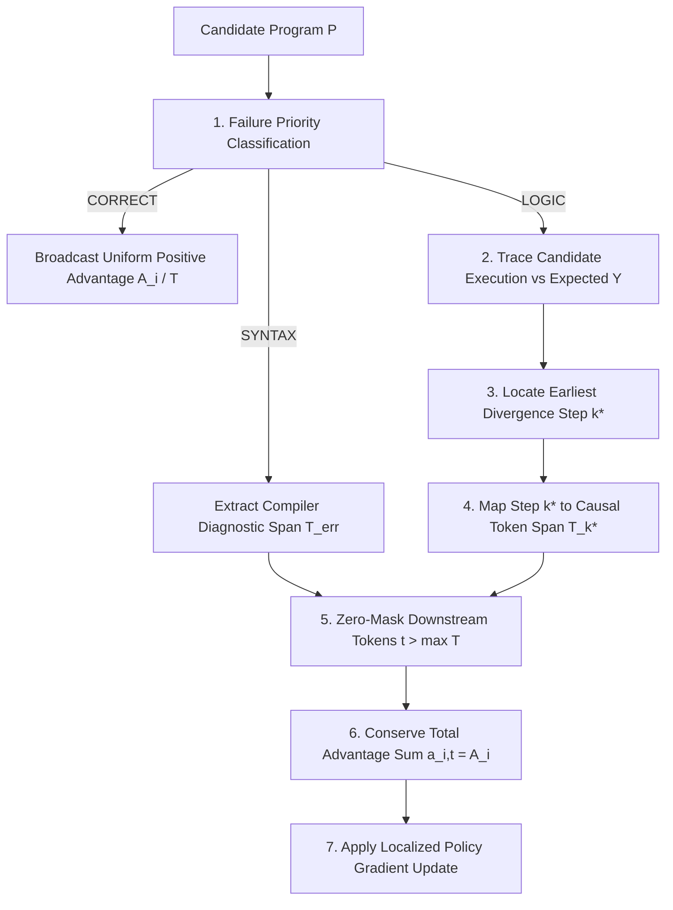
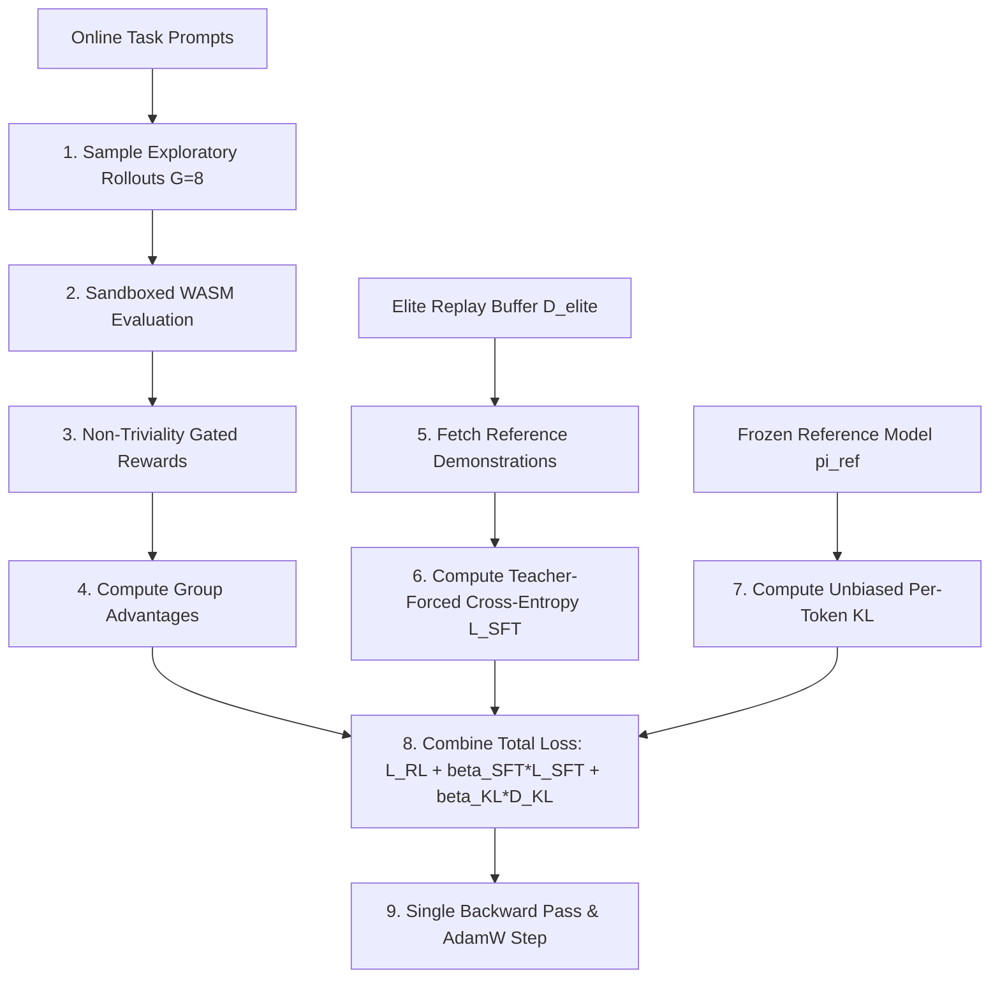
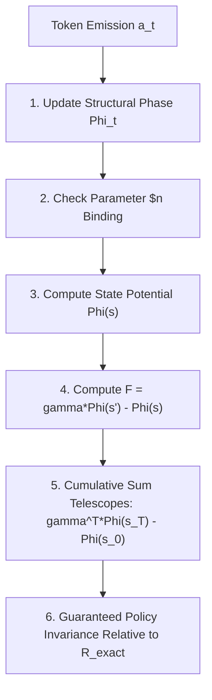

# Data Model: Inductive Algorithmic Generalization, Anti-Shortcut Regularization & Fine-Grained Credit Assignment

**Feature**: [specs/003-algorithmic-generalization-and-credit-assignment/spec.md](specs/003-algorithmic-generalization-and-credit-assignment/spec.md)  
**Branch**: `003-algorithmic-generalization-and-credit-assignment`  
**Date**: 2026-09-01

---

## 1. Domain Entities & Schemas

### Entity: `NonTrivialityEvaluation`
Captures empirical output dynamics, input sensitivity, and non-triviality gating status for a candidate program execution.

| Field | Type | Description | Validation Rules |
| :--- | :--- | :--- | :--- |
| `output_variance` | `float` | Empirical variance $\mathbb{Var}_n[P(n)]$ across evaluated terms | Non-negative float |
| `target_variance` | `float` | Empirical variance $\mathbb{Var}_n[y_n]$ of target sequence | Non-negative float |
| `input_sensitivity` | `float` | Differential sensitivity $\mathcal{S}_{\text{input}}(P) = \sum |P(n+1) - P(n)|$ | Non-negative float |
| `has_param_binding` | `bool` | Whether AST contains active parameter references (`local.get $n`) | Boolean |
| `mutual_information_score`| `float` | Batch-level cross-input mutual information proxy $R_{\text{MI}}$ | Finite FP32 float |
| `is_non_trivial` | `bool` | Gate authorization flag (`True` if program is dynamic or matches constant target) | Boolean |
| `penalty` | `float` | Penalty value applied if trivial shortcut is detected | $\le 0.0$ ($0.0$ if non-trivial) |

---

### Entity: `CoTrainingBatch`
Encapsulates an online training batch pairing RL exploratory rollouts with teacher-forced SFT demonstration sequences and reference policy probabilities.

| Field | Type | Description | Validation Rules |
| :--- | :--- | :--- | :--- |
| `prompt_records` | `List[SequenceRecord]` | Minibatch of active prompt sequence records ($B=1\text{--}4$) | Non-empty list |
| `rollout_tokens` | `Tensor[int64, (B*G, L)]` | Sampled program token trajectories ($G=4\text{--}8$) | Valid vocabulary indices |
| `sft_demonstrations` | `List[SyntheticDemonstrationPair]` | Blended elite demonstrations for SFT loss ($M = B$) | Non-empty list |
| `ref_log_probs` | `Optional[Tensor[float32, (B*G, L)]]` | Reference policy $\pi_{\text{ref}}$ log probabilities for KL penalty | Finite FP32 floats or null |
| `beta_sft` | `float` | Weight coefficient for blended SFT loss $\beta_{\text{SFT}}$ | $0.0 \le \beta_{\text{SFT}} \le 1.0$ (default 0.20) |
| `beta_kl` | `float` | Weight coefficient for Schulman KL divergence penalty | $0.0 \le \beta_{\text{KL}} \le 0.5$ (default 0.05) |

---

### Entity: `FineGrainedAttributionSpan`
Stores localized credit assignment spans, mapping failure mode, divergence step $k^*$, token span $T_{k^*}$, downstream zero-masking indices, and basic block coverage.

| Field | Type | Description | Validation Rules |
| :--- | :--- | :--- | :--- |
| `failure_mode` | `String` | Deterministic priority gate classification | One of: `SYNTAX`, `CONSTRAINT`, `LOGIC`, `CORRECT` |
| `divergence_step` | `Optional[int]` | Index $k^*$ of earliest sequence term mismatch | Integer $\in [0, N-1]$ or null |
| `causal_token_start` | `int` | Start index of causal error token window $\min T_{k^*}$ | $0 \le \text{start} \le L$ |
| `causal_token_end` | `int` | End index of causal error token window $\max T_{k^*}$ | $\text{start} < \text{end} \le L$ |
| `token_advantage_mask` | `List[float]` | Localized per-token advantage weights ($a_{i,t}$) | Sums to total advantage $A_i$; zero for $t > \text{end}$ |
| `executed_token_mask` | `List[bool]` | Basic block runtime coverage mask (FGO) | Length equals sequence length $L$ |

---

### Entity: `PotentialState`
Tracks potential-based shaping variables ($\Phi(s)$, $\phi_{\text{comp}}$, $\phi_{\text{bind}}$) across incremental AST decoding steps to enforce policy invariance.

| Field | Type | Description | Validation Rules |
| :--- | :--- | :--- | :--- |
| `step` | `int` | Autoregressive decoding step index $t$ | Non-negative integer |
| `structural_phase` | `StructuralPhase` | Active decoding phase ($\Phi_t$) | Valid `StructuralPhase` enum |
| `phi_comp` | `float` | Potential allocated for structural phase completion | Float $\in [0.0, 0.5]$ |
| `phi_bind` | `float` | Potential allocated for explicit parameter `$n` binding | Float $\in [0.0, 0.5]$ |
| `total_potential` | `float` | Cumulative state potential $\Phi(s) = \phi_{\text{comp}} + \phi_{\text{bind}}$ | Finite FP32 float |
| `shaping_difference` | `float` | Step potential difference $F(s, a, s') = \gamma \Phi(s') - \Phi(s)$ | Finite FP32 float |

---

### Entity: `LexicaseSelectionBatch`
Tracks per-test-case rollout evaluations across randomized sequence indices for down-sampled lexicase filtering.

| Field | Type | Description | Validation Rules |
| :--- | :--- | :--- | :--- |
| `prompt_id` | `String` | Reference OEIS identifier | Valid `oeis_id` |
| `test_case_indices` | `List[int]` | Randomized order of evaluation indices $n_r \in [0, N-1]$ | Permutation of subset of $[0, N-1]$ |
| `candidate_errors` | `Dict[int, List[float]]` | Per-candidate absolute error vector across test cases | Map from candidate index to error list |
| `surviving_candidates` | `List[int]` | Candidate indices surviving down-sampled filtering | Non-empty subset of candidate indices |

---

### Entity: `ExtrapolationBenchmarkResult`
Captures verification metrics over $N+K$ terms ($N=20, K=100$), compiled byte size, sequence Lempel-Ziv complexity, Minimum Description Length ratio $M_{\text{MDL}}$, and graduation eligibility.

| Field | Type | Description | Validation Rules |
| :--- | :--- | :--- | :--- |
| `oeis_id` | `String` | Reference OEIS identifier | Valid `oeis_id` |
| `train_terms_passed` | `int` | Number of context terms matched ($n \in [0, 19]$) | Integer $\in [0, 20]$ |
| `extrap_terms_passed` | `int` | Number of unseen future terms matched ($n \in [20, 119]$) | Integer $\in [0, 100]$ |
| `extrapolation_passed` | `bool` | Whether 100% of extrapolation terms matched ($G_{\text{ext}} = 1.0$) | Strictly `True` if `extrap_terms_passed == 100` |
| `byte_size` | `int` | Compiled WebAssembly binary byte size | Positive integer |
| `lz_complexity` | `float` | Sequence Lempel-Ziv compression size | Positive float |
| `mdl_ratio` | `float` | Minimum Description Length ratio $M_{\text{MDL}} = \frac{|P|_{\text{bytes}}}{C(A_N)}$ | Positive float ($\le 1.20$ required) |
| `graduation_authorized`| `bool` | Whether candidate satisfies both extrapolation and MDL | Boolean |

---

### Entity: `DiscoveredIdentityRecord`
Formal representation of an uncovered algebraic relation, including vector Euclidean distance, arbitrary-precision PSLQ integer certificate ($<10^{-50}$ drop), SymPy proof status, and Markdown proof export.

| Field | Type | Description | Validation Rules |
| :--- | :--- | :--- | :--- |
| `identity_id` | `String` | Unique relation UUID | Valid UUIDv4 |
| `relation_type` | `String` | Relation category (`"LINEAR_SUM"`, `"CAUCHY_CONV"`, `"BINOMIAL_PAIR"`) | Valid relation enum |
| `sequence_ids` | `Tuple[String, ...]` | Participating OEIS A-numbers | Valid `oeis_id` tuple |
| `latent_distance` | `float` | Vector arithmetic Euclidean distance $\|\sum c_i \vec{v}_i\|_2$ | Float $< \epsilon_{\text{geom}}$ |
| `pslq_vector` | `List[int]` | High-precision integer relation vector $a \in \mathbb{Z}^k$ | Non-zero integer list |
| `pslq_confidence_drop`| `float` | Ratio $\min_i |y_i| / \max_i |y_i|$ | Float $< 10^{-50}$ for confirmed relations |
| `symbolic_proof` | `Optional[String]` | Formal proof generated by SymPy | Non-empty string or null |
| `proof_status` | `String` | Prover outcome | One of: `"CONJECTURED"`, `"PSLQ_VERIFIED"`, `"PROVEN"`, `"REJECTED"` |

---

## 2. State Transition Diagrams

### Downstream Token Zero-Masking and Credit Attribution Flow

### SFT Co-Training & Policy Regularization Flow

### Potential-Based Reward Shaping (PBRS) Lifecycle

