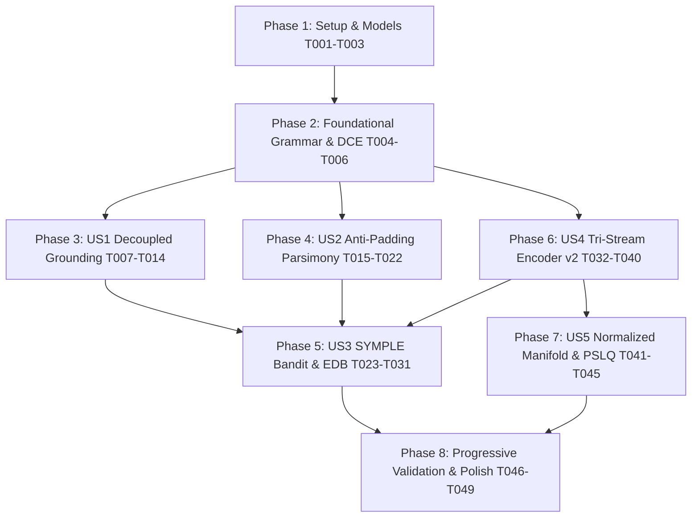

# Tasks: Decoupled Symbolic-Numeric Grounding, Parsimony-Regularized RLVR & SYMPLE Multi-Task Engine

**Input**: Design documents from `/specs/004-decoupled-grounding-and-symple-engine/`  
**Prerequisites**: [plan.md](specs/004-decoupled-grounding-and-symple-engine/plan.md), [spec.md](specs/004-decoupled-grounding-and-symple-engine/spec.md), [research.md](specs/004-decoupled-grounding-and-symple-engine/research.md), [data-model.md](specs/004-decoupled-grounding-and-symple-engine/data-model.md), [contracts/](specs/004-decoupled-grounding-and-symple-engine/contracts/)

## Format: `[ID] [P?] [Story] Description with file path`

- **[P]**: Can run in parallel (different files, no dependencies on incomplete tasks)
- **[Story]**: Which user story this task belongs to (`[US1]`, `[US2]`, `[US3]`, `[US4]`, `[US5]`)
- Include exact file paths in descriptions

---

## Phase 1: Setup (Shared Infrastructure)

**Purpose**: Establish configuration profiles, data models, and schemas for Phase 4 decoupled grounding, parsimony regularization, and SYMPLE multi-task scheduling.

- [x] T001 Update training configuration profile with Phase 4 hyperparameters in `configs/train_tier1.yaml`
  - Define `symple` block: `rollout_budget: 32`, `active_prompts: 2`, `min_group_size: 8`, `max_group_size: 16`, `replay_prompts: 2`, `beta_sft_replay: 0.50`, `beta_kl_penalty: 0.02`, `exp3_gamma: 0.15`, `exp3_alpha: 0.05`, `competence_window: 20`, `edb_capacity_per_seq: 4`, `enable_virtual_sample_injection: true`.
  - Define `solver` block: `enable_diophantine: true`, `enable_smt: true`, `smt_timeout_ms: 250`, `max_placeholders: 4`.
  - Define `parsimony` block: `enable_dce: true`, `waste_penalty_weight: 0.20`, `hard_waste_threshold: 0.30`, `alpha_sem_entropy: 0.02`, `beta_struct_penalty: 0.05`, `temperature_base: 0.80`, `temperature_stack_decay: 0.60`.
  - Define `model` block: `d_model: 256`, `n_heads: 4`, `n_encoder_layers: 4`, `n_decoder_layers: 4`, `primes: [3, 5, 7, 11, 13, 17, 19, 23, 29, 31, 37, 41, 43, 47, 53, 59]`, `enable_summary_tokens: true`, `lambda_aux_loss: 0.10`.
- [x] T002 [P] Define Phase 4 domain entities in `src/oeis_learn/data/models.py`
  - Implement dataclass `ASTSkeleton`: `raw_wat: str`, `placeholder_count: int`, `is_linear: bool`, `placeholder_indices: List[int]`, `basis_signatures: List[str]`.
  - Implement dataclass `ConstantSolverResult`: `solver_type: str`, `constants: Optional[List[int]]`, `solve_duration_ms: float`, `is_sat: bool`, `grounded_wat: Optional[str]`, `error_message: Optional[str]`.
  - Implement dataclass `CanonicalProgramArtifact`: `raw_wat: str`, `opt_wat: str`, `raw_token_count: int`, `opt_token_count: int`, `waste_ratio: float`, `passes_applied: List[str]`, `is_waste_exceeded: bool`.
  - Implement dataclass `ParsimonyRewardRecord`: `dense_return: float`, `covariance_coef: float`, `parsimony_penalty: float`, `waste_penalty: float`, `cpp_reward: float`, `lexicographic_rank: int`, `ordinal_advantage: float`.
  - Implement dataclass `SYMPLETaskState`: `oeis_id: str`, `pass_history: List[int]`, `competence: float`, `competence_slope: float`, `bandit_weight: float`, `selection_prob: float`, `last_visited_step: int`, `dormancy: int`, `has_elite_solution: bool`.
  - Implement dataclass `EliteDemonstrationEntry`: `oeis_id: str`, `canonical_wat: str`, `token_length: int`, `fuel_consumed: int`, `ast_hash: str`, `discovery_step: int`, `mdl_score: float`.
  - Implement dataclass `NormalizedLatentRecord`: `oeis_id: str`, `raw_embedding: List[float]`, `normalized_embedding: List[float]`, `cluster_id: int`, `affine_slope_pred: float`, `geom_ratio_pred: float`, `discovered_relations: List[str]`.
- [x] T003 [P] Update CLI argument parser and command definitions for Phase 4 in `src/oeis_learn/cli/main.py`
  - Add subcommands and options per [contracts/cli-interface.contract.json](specs/004-decoupled-grounding-and-symple-engine/contracts/cli-interface.contract.json):
    - `solve-constants`: `--wat-file`, `--terms`, `--timeout-ms`, `--output-wat`.
    - `generate-sft`: `--enable-affine-sweeps`, `--scale-min-pow`, `--scale-max-pow`.
    - `discover`: `--normalize-l2`, `--distance-threshold`.
    - `train`: `--enable-symple`, `--enable-solver`, `--enable-dce`, `--tier 1`.

---

## Phase 2: Foundational (Blocking Prerequisites)

**Purpose**: Core grammar extensions, placeholder terminals, and compiler optimization hooks that block user stories.

**⚠️ CRITICAL**: No user story work can begin until this foundational phase is complete.

- [x] T004 Update grammar definitions and tokenizer vocabularies to register `i64.const_?` in `src/oeis_learn/decoder/wat_grammar.py` and `src/oeis_learn/decoder/grammar_masker.py`
  - In `wat_grammar.py`, add `i64.const_?` as a recognized terminal in the constant instruction production rule matching [contracts/wat-grammar.ebnf](specs/004-decoupled-grounding-and-symple-engine/contracts/wat-grammar.ebnf).
  - In `grammar_masker.py`, update `EnvironmentTracker` and Earley trie validator to permit `i64.const_?` wherever an immediate integer literal is legal.
  - Ensure stack depth push semantics ($\Delta \Sigma = +1$) and type `[i64]` are preserved when `i64.const_?` is emitted.
- [x] T005 [P] Integrate native `wasm-opt` Dead Code Elimination (DCE) pass in `crates/oeis_wasm_evaluator/src/sandbox.rs` and `crates/oeis_wasm_evaluator/src/lib.rs`
  - Add `binaryen-rs` or native C-FFI Binaryen optimization pass bindings to `crates/oeis_wasm_evaluator/Cargo.toml`.
  - In `sandbox.rs`, implement `optimize_wat_module(raw_wat: &str) -> Result<(Vec<u8>, String, usize, usize), EvaluatorError>` running passes `--vacuum`, `--dce`, `--remove-unused-locals`.
  - Return compiled optimized binary bytes, disassembled text, raw token count, and optimized token count.
  - Export `optimize_and_evaluate_wat_batch` through PyO3 in `crates/oeis_wasm_evaluator/src/lib.rs`.
- [x] T006 [P] Integrate Binaryen optimizer bridge and syntactic waste ratio calculator in `src/oeis_learn/sandbox/runner.py`
  - In `runner.py`, implement `run_optimized_wasm_batch(wat_programs: List[str], target_terms_batch: List[List[int]], fuel_limit: int = 10000) -> List[Tuple[ExecutionResult, CanonicalProgramArtifact]]`.
  - Calculate `waste_ratio = (raw_tokens - opt_tokens) / raw_tokens` with clipping $\in [0.0, 1.0]$.
  - Add fallback optimizer path in `src/oeis_learn/sandbox/fallback_runner.py` for environments lacking Binaryen native libraries.

**Checkpoint**: Foundation ready — user story implementation can now proceed.

---

## Phase 3: User Story 1 - Decoupled Symbolic-Numeric Grounding & Diophantine/SMT Solvers (Priority: P1) 🎯 MVP

**Goal**: Enable the autoregressive decoder to emit abstract AST skeletons with `i64.const_?` placeholders and resolve exact integer parameters instantaneously via exact Hermite Normal Form (HNF) Diophantine row reduction ($<1\,\text{ms}$) and Z3 SMT fallback ($<250\,\text{ms}$).

**Independent Test**: Pass a batch of synthesized program skeletons with 1 to 4 placeholders across linear, affine, quadratic, and modular sequence targets; verify that the solver pipeline computes exact integer constants in $<2\,\text{ms}$ for linear traces and $<250\,\text{ms}$ for non-linear traces, producing 100% ground-truth matching programs.

### Tests for User Story 1

- [x] T007 [P] [US1] Contract test for Constant Solver interface schema in `tests/contract/test_constant_solver_contract.py`
  - Validate JSON schema conformance against [contracts/constant-solver.contract.json](specs/004-decoupled-grounding-and-symple-engine/contracts/constant-solver.contract.json).
  - Test valid requests, invalid inputs (e.g. $<20$ terms), timeout violations, and response structure.
- [x] T008 [P] [US1] Unit test for exact Hermite Normal Form (HNF) Diophantine linear integer solver in `tests/unit/test_constant_solver.py`
  - Test linear affine sequences $a(n) = 5n + 2 \implies c_0=2, c_1=5$.
  - Test quadratic polynomial sequences $a(n) = 3n^2 - 4n + 7$.
  - Test underdetermined linear systems where multiple solutions exist, verifying minimum $L_1$-norm selection ($\mathbf{C}^* = \arg\min \|\mathbf{C}\|_1$).
  - Test inconsistent linear systems, verifying graceful return of `is_sat=False`.
  - Verify execution time is $<1.0\,\text{ms}$ per test case.
- [x] T009 [P] [US1] Unit test for Z3 SMT `QF_BV` non-linear constant solver fallback in `tests/unit/test_smt_constant_solver.py`
  - Test modulo expressions containing `i64.rem_u` and `i64.const_?`.
  - Test bitwise shift expressions containing `i64.shl` and `i64.const_?`.
  - Test conditional branch predicates (`br_if`) with placeholder thresholds.
  - Test timeout enforcement: verify that equations exceeding $250\,\text{ms}$ safely return `solver_type="TIMEOUT"` without hanging the process.

### Implementation for User Story 1

- [x] T010 [US1] Implement AST skeleton parser and placeholder extraction (`parse_ast_placeholders`) in `src/oeis_learn/decoder/constant_solver.py`
  - Implement `parse_ast_placeholders(wat_code: str) -> ASTSkeleton`:
    - Scan tokens in `wat_code` and locate occurrences of `i64.const_?`.
    - If count $k == 0$ or $k > 4$, flag accordingly.
    - Inspect surrounding AST context to determine linearity: if placeholders are only operands to `i64.add`, `i64.sub`, or multiplicative scale of basis terms with no nesting inside `rem_u`/`shl`/`div`/branches, set `is_linear = True`.
    - Extract partial basis expressions for sandbox execution.
- [x] T011 [US1] Implement exact Diophantine linear solver using Hermite Normal Form (`solve_linear_diophantine`) in `src/oeis_learn/decoder/constant_solver.py`
  - Implement `solve_linear_diophantine(skeleton: ASTSkeleton, terms: List[int], runner: WasmRunner) -> ConstantSolverResult`:
    - For a skeleton with $k$ placeholders, execute basis functions $f_j(n)$ in the WASM sandbox across $n \in \{0, \dots, 19\}$.
    - Construct integer matrix $A \in \mathbb{Z}^{20 \times (k+1)}$ where column $0$ is $1$ (constant offset) and column $j$ is $[f_j(0), \dots, f_j(19)]^T$.
    - Perform exact integer rank reduction or least-squares integer check via NumPy/SciPy exact rational matrix solving.
    - Check if $A \mathbf{C} = Y$ holds exactly for all 20 terms over $\mathbb{Z}$.
    - If underdetermined, solve $\arg\min \|\mathbf{C}\|_1$ subject to $A \mathbf{C} = Y$.
    - Return `ConstantSolverResult` with `is_sat=True`, concrete constants, and `solver_type="DIOPHANTINE_HNF"`.
- [x] T012 [US1] Implement SMT fallback constant solver using Z3 BitVectors (`solve_smt_constants`) in `src/oeis_learn/decoder/constant_solver.py`
  - Implement `solve_smt_constants(skeleton: ASTSkeleton, terms: List[int], timeout_ms: int = 250) -> ConstantSolverResult`:
    - Create Z3 solver instance with logic `QF_BV` and timeout configuration (`solver.set("timeout", timeout_ms)`).
    - Declare 64-bit BitVector constants $c_1, \dots, c_k \in \text{BitVecVal}(64)$.
    - Lower WAT instructions (arithmetic, bitwise, modulo, conditional logic) to Z3 BitVector expressions.
    - Assert constraints $\bigwedge_{n=0}^{19} (P_{\mathbf{C}}(n) == \text{BitVecVal}(y_n, 64))$.
    - Check satisfiability (`solver.check() == sat`).
    - Extract concrete integer values from model: $c_j = \text{model}[c_j].\text{as_signed_long}()$.
    - Return `ConstantSolverResult` with `solver_type="Z3_SMT"`.
- [x] T013 [US1] Implement constant splicing and grounded WAT assembly (`splice_constants_into_wat`) in `src/oeis_learn/decoder/constant_solver.py`
  - Implement `splice_constants_into_wat(skeleton: ASTSkeleton, constants: List[int]) -> str`:
    - Replace each `i64.const_?` token in `skeleton.raw_wat` with `i64.const <constants[i]>` in sequential order.
    - Verify that spliced WAT string compiles to valid WebAssembly without syntax errors.
- [x] T014 [US1] Integrate decoupled solver dispatch into rollout generation and decouple GRPO skeleton policy gradients from grounded EDB program storage in `src/oeis_learn/rl/trainer.py`
  - In `trainer.py`, when candidate completions contain `i64.const_?`:
    - Dispatch `solve_linear_diophantine`; if `is_sat=False` and non-linear, fallback to `solve_smt_constants`.
    - If solver succeeds:
      - Construct grounded WAT string with concrete constants and execute in sandbox to verify $R_{\text{exec}} = 1.0$.
      - Assign $R_{\text{exec}} = 1.0$ to the candidate in the rollout group.
      - **Policy Gradient Decoupling**: Backpropagate $\mathcal{L}_{\text{GRPO}}$ through the emitted skeleton token sequence (containing `i64.const_?` placeholders).
      - **Demonstration Storage**: Ingest the concrete grounded program into the Elite Demonstration Buffer $\mathcal{D}_{\text{elite}}$.

**Checkpoint**: User Story 1 is functional — the policy synthesizes topological skeletons while Diophantine and SMT solvers ground exact constants in $<1\,\text{ms}$, eliminating literal prediction mode collapse.

---

## Phase 4: User Story 2 - Anti-Padding Parsimony Regularization & Compiler-in-the-Loop RLVR (Priority: P1) 🎯 MVP

**Goal**: Integrate online `wasm-opt` compiler passes (`--vacuum`, `--dce`, `--remove-unused-locals`) into verification, penalizing dead-code waste with a hard $30\%$ cutoff, continuous dense log-distance rewards, Covariant Parsimony Pressure (CPP), and Lexicographical Group Advantage Ranking ($R_{\text{exec}} \succ -|P_{\text{opt}}|$).

**Independent Test**: Generate a batch of padded programs containing redundant stack pairs and dead variable writes; verify that the optimizing compiler pass strips all dead operations in $<1.5\,\text{ms}$, computes exact syntactic waste ratio $\rho_{\text{waste}}$, and assigns negative ordinal advantages to bloated candidates relative to compact equivalents.

### Tests for User Story 2

- [x] T015 [P] [US2] Unit test for continuous log-distance return ($R_{\text{dense}}$) and hard waste cutoff ($\tau_{\text{thresh}} = 0.30$) in `tests/unit/test_parsimony_rlvr.py`
  - Test $R_{\text{dense}}(P, Y)$ calculation across exact matches ($1.0$), slight slope deviations ($0.70$), and flatline predictions ($0.15$).
  - Test hard waste cutoff: verify that programs with $\rho_{\text{waste}} > 0.30$ receive $R_{\text{validity}} = 0.0$.
  - Test exponential validity decay: $0.1 \cdot \exp(-2.0 \cdot \rho_{\text{waste}})$ for $\rho_{\text{waste}} \le 0.30$.
- [x] T016 [P] [US2] Unit test for Covariant Parsimony Pressure ($c_k$) and Lexicographical Group Ranking in `tests/unit/test_lexicographic_ranking.py`
  - Test covariance coefficient $c_k = \frac{\operatorname{Cov}(\ell, R)}{\operatorname{Var}(\ell) + \varepsilon}$: verify that when length correlates negatively with reward, parsimony penalty is positive.
  - Test lexicographical comparator: candidate with $(R=1.0, \text{len}=15)$ strictly outranks $(R=1.0, \text{len}=25)$.
  - Test functional dominance: candidate with $(R=1.0, \text{len}=30)$ strictly outranks $(R=0.1, \text{len}=5)$.
  - Test normalized ordinal advantage formula: $\hat{A}_i^{\text{lex}} = \frac{2(\operatorname{rank}-1)}{G-1} - 1 \in [-1, 1]$.
- [x] T017 [P] [US2] Unit test for Partitioned Semantic Policy Entropy ($\mathcal{H}_{\text{sem}}$) and stack-depth temperature scaling in `tests/unit/test_partitioned_entropy.py`
  - Test entropy partition into $\mathcal{A}_{\text{sem}}$ (arithmetic, variables, loops) vs $\mathcal{A}_{\text{struct}}$ (`drop`, `nop`).
  - Verify that high probability on `drop` incurs penalty $-0.05 \cdot \max(0, P(\mathcal{A}_{\text{struct}}) - 0.15)$.
  - Test temperature scaling: verify $T(s_t) = T_{\text{base}} \cdot (1 - 0.6 \frac{\Sigma_t}{\Sigma_{\max}})$ decreases monotonically as stack height approaches 1.

### Implementation for User Story 2

- [x] T018 [US2] Implement continuous dense log-distance return $R_{\text{dense}}(P, Y)$ and hard waste threshold gating in `src/oeis_learn/rl/reward.py`
  - In `reward.py`, implement `compute_dense_log_distance_reward(outputs: List[int], targets: List[int]) -> float`:
    $$R_{\text{dense}} = \frac{1}{20} \sum_{n=0}^{19} \frac{1}{1 + \log_{10}(|P(n) - y_n| + 1)}$$
  - Implement `compute_validity_reward(waste_ratio: float, threshold: float = 0.30, kappa: float = 2.0) -> float`:
    $$R_{\text{validity}} = \begin{cases} 0.1 \cdot \exp(-\kappa \cdot \rho_{\text{waste}}) & \text{if } \rho_{\text{waste}} \le 0.30 \\ 0.0 & \text{if } \rho_{\text{waste}} > 0.30 \end{cases}$$
- [x] T019 [US2] Implement group Covariant Parsimony Pressure (CPP) penalty calculation in `src/oeis_learn/rl/reward.py`
  - Implement `compute_covariant_parsimony_penalty(lengths: List[int], rewards: List[float], waste_ratios: List[float], lambda_waste: float = 0.20) -> List[float]`:
    - Compute covariance $\operatorname{Cov}(\ell, R)$ and variance $\operatorname{Var}(\ell)$.
    - Compute dynamic coefficient $c_k = \frac{\operatorname{Cov}(\ell, R)}{\operatorname{Var}(\ell) + 10^{-6}}$.
    - For each rollout: $R_{\text{CPP}, i} = R_i - \max(0, -c_k) \cdot (\ell_i - \min \ell) - \lambda_{\text{waste}} \cdot \rho_{\text{waste}, i}$.
- [x] T020 [US2] Implement Lexicographical Group Advantage Ranking ($R_{\text{exec}} \succ -|P_{\text{opt}}|$) in `src/oeis_learn/rl/reward.py`
  - Implement `compute_lexicographic_advantages(group_results: List[Tuple[float, int]]) -> List[float]`:
    - Sort rollouts using tuple comparator key `(reward, -opt_length)`.
    - Assign ranks $1 \dots G$.
    - Map to ordinal advantages $\hat{A}_i^{\text{lex}} = \frac{2 \cdot (\operatorname{rank}_i - 1)}{G - 1} - 1 \in [-1, 1]$.
- [x] T021 [US2] Implement Partitioned Semantic Entropy loss ($\mathcal{L}_{\text{ent}}$) and stack-depth temperature scheduler in `src/oeis_learn/rl/egca_grpo.py`
  - In `egca_grpo.py`, implement `compute_partitioned_semantic_entropy(logits: Tensor, valid_mask: Tensor, sem_indices: List[int], struct_indices: List[int], alpha_sem: float = 0.02, beta_pen: float = 0.05) -> Tensor`:
    - Compute normalized semantic entropy $\mathcal{H}_{\text{sem}}$ over `sem_indices`.
    - Compute total structural mass $P(\mathcal{A}_{\text{struct}})$.
    - Return loss term $\mathcal{L}_{\text{ent}} = \alpha_{\text{sem}} \frac{\mathcal{H}_{\text{sem}}}{\log |\mathcal{A}_{\text{sem}}| + \epsilon} - \beta_{\text{pen}} \max(0, P(\mathcal{A}_{\text{struct}}) - 0.15)$.
  - Implement `get_dynamic_sampling_temperature(stack_height: int, max_stack: int = 16, t_base: float = 0.80, decay: float = 0.60) -> float`:
    - Return $T = t_{\text{base}} \cdot (1.0 - decay \cdot \frac{\text{stack\_height}}{\text{max\_stack}})$.
- [x] T022 [US2] Integrate online compiler canonicalization and parsimony rewards into training loop in `src/oeis_learn/rl/trainer.py`
  - Update rollout verification step: pass all sampled candidates through `run_optimized_wasm_batch`, compute $\rho_{\text{waste}}$, apply hard waste threshold cutoff ($0.30$), evaluate CPP penalties, and compute lexicographical advantages.

**Checkpoint**: User Stories 1 and 2 are functional — AST padding attractors are eliminated and compact algorithms are rewarded over bloated variations.

---

## Phase 5: User Story 3 - SYMPLE Bandit Curriculum & Elite Demonstration Replay (Priority: P2)

**Goal**: Implement the SYMPLE execution loop with EXP3.S non-stationary bandit task scheduling targeting the Zone of Proximal Development, Ada-G dynamic group sizing ($G_i \in [8, 16]$ with $B_{\text{active}}=2$), Virtual Sample Injection, and Elite Demonstration Buffer (EDB) dormancy-weighted SFT consistency replay ($B_{\text{replay}}=2$).

**Independent Test**: Simulate 100 training steps over a 524-sequence pool; verify that EXP3.S concentrates $\ge 70\%$ of active sampling on frontier tasks ($0.05 \le \hat{p}_i \le 0.50$), Ada-G allocates deep groups ($G_i \in [8, 16]$) ensuring $P(\text{Hit} \ge 1) \ge 0.50$, and EDB replays dormant sequences to maintain $100\%$ retention on previously solved tasks.

### Tests for User Story 3

- [x] T023 [P] [US3] Contract test for SYMPLE configuration schema in `tests/contract/test_symple_config_contract.py`
  - Validate JSON schema conformance against [contracts/symple-config.schema.json](specs/004-decoupled-grounding-and-symple-engine/contracts/symple-config.schema.json).
  - Test valid hyperparameter configurations and bound assertions ($G_{\min} \ge 8, G_{\max} \le 64, \gamma \in [0.01, 0.5]$).
- [x] T024 [P] [US3] Unit test for EXP3.S non-stationary bandit scheduler and learning progress feedback in `tests/unit/test_symple_curriculum.py`
  - Test binomial dispersion reward $p_i(1 - p_i)$: verify peak at $p=0.5$ and decay at $p \to 0$ and $p \to 1$.
  - Test competence slope velocity $\Delta C_i = \text{mean}(W_i^{\text{late}}) - \text{mean}(W_i^{\text{early}})$.
  - Test arm probability updates: verify non-zero sampling floor ($\gamma_{\text{exp3}} / K$) across all 524 arms.
- [x] T025 [P] [US3] Unit test for Ada-G dynamic group sizing ($G_i \in [8, 16]$) and Virtual Sample Injection in `tests/unit/test_adag_allocator.py`
  - Test Ada-G group allocation: $\hat{p} = 0.02 \implies G = 16$; $\hat{p} = 0.50 \implies G = 8$.
  - Test total active rollout constraint: $\sum G_i \le M_{\text{active}} = 32$.
  - Test Virtual Sample Injection: verify that when all rollouts fail ($k=0$) on a sequence with EDB history, $r=1.0$ is injected, producing non-zero negative advantage $\hat{A}^- = -1/\sqrt{G}$.
- [x] T026 [P] [US3] Unit test for Elite Demonstration Buffer (EDB) dormancy-weighted replay sampling in `tests/unit/test_elite_buffer_replay.py`
  - Test EDB ingestion: deduplication via AST structural hash, capacity bounded to top-4 shortest programs per sequence.
  - Test dormancy priority sampling: sequences with largest $\Delta t_{\text{dormant}} = t_{\text{current}} - t_{\text{last\_visit}}$ are selected with highest probability.

### Implementation for User Story 3

- [x] T027 [US3] Implement `Exp3SBanditScheduler` with binomial dispersion and score velocity tracking in `src/oeis_learn/curriculum/symple_bandit.py`
  - Create `src/oeis_learn/curriculum/symple_bandit.py`.
  - Implement class `Exp3SBanditScheduler`:
    - Initialize weights $w_i = 1.0$ for all $K=524$ sequences.
    - Implement `sample_active_prompts(batch_size: int = 2) -> List[str]`.
    - Implement `update_feedback(oeis_id: str, success_count: int, group_size: int)`:
      - Update rolling history window $W_i$ (size 20).
      - Compute $\hat{p}_i = \text{mean}(W_i)$ and slope $\Delta C_i$.
      - Compute feedback $r_{i,t} = \hat{p}_i(1 - \hat{p}_i) + |\Delta C_i| + 2.0 \max(0, -\Delta C_i)$.
      - Update EXP3.S weight: $w_{i, t+1} = w_{i, t} \exp(\frac{\gamma \hat{r}_{i,t}}{K}) + \frac{e \alpha}{K} \sum w_j$.
- [x] T028 [US3] Implement `AdaGGroupAllocator` for dynamic rollout sizing ($G_i \in [8, 16]$) in `src/oeis_learn/curriculum/symple_bandit.py`
  - Implement class `AdaGGroupAllocator`:
    - Implement `compute_group_sizes(prompts: List[str], bandit: Exp3SBanditScheduler, total_budget: int = 32, min_g: int = 8, max_g: int = 16) -> Dict[str, int]`:
      - For each prompt $q_i$, extract competence $\hat{p}_i$.
      - Compute $G_i = \text{clip}(\lceil \frac{\ln(1 - 0.50)}{\ln(1 - \max(\hat{p}_i, 0.02))} \rceil, \text{min\_g}, \text{max\_g})$.
      - Normalize so $\sum G_i \le \text{total\_budget}$.
- [x] T029 [US3] Update `EliteDemonstrationBuffer` with MDL deduplication, top-4 capacity, and dormancy sampling in `src/oeis_learn/rl/elite_buffer.py`
  - In `elite_buffer.py`:
    - Implement capacity limit $E=4$ programs per sequence ID.
    - Implement AST canonical hashing for deduplication.
    - Implement `sample_dormancy_vulnerable_batch(batch_size: int = 2, current_step: int = 0) -> List[Tuple[str, str]]`:
      - Compute $\Delta t_{\text{dormant}} = \text{current\_step} - t_{\text{last\_visit}}[i]$ for all sequences with verified programs.
      - Sample `batch_size` sequences proportional to dormancy.
      - Return shortest canonical WAT program for each sampled sequence.
- [x] T030 [US3] Implement Virtual Sample Injection for all-failure rollout recovery in `src/oeis_learn/rl/egca_grpo.py`
  - In `egca_grpo.py`, implement `inject_virtual_sample_if_needed(group_rewards: List[float], has_edb_solution: bool) -> List[float]`:
    - If all $r \in \text{group\_rewards} == 0.0$ and `has_edb_solution == True`:
      - Append synthetic reward $1.0$ to the group statistics for advantage normalization.
      - Compute standardized advantages for the actual rollouts: $\hat{A}^- = \frac{0 - 1/(G+1)}{\sigma_R} = -1/\sqrt{G}$.
- [x] T031 [US3] Implement unified SYMPLE execution loop with joint loss $\mathcal{L}_{\text{total}}$ in `src/oeis_learn/rl/trainer.py`
  - Orchestrate the complete 10-step SYMPLE loop:
    1. Sample $B_{\text{active}}=2$ prompts from `Exp3SBanditScheduler`.
    2. Compute $G_i \in [8, 16]$ from `AdaGGroupAllocator`.
    3. Generate rollouts with `i64.const_?` placeholders.
    4. Ground constants via Diophantine/SMT solvers.
    5. Evaluate `wasm-opt` DCE and CPP rewards.
    6. Apply Virtual Sample Injection if $k_i=0$ and EDB solution exists.
    7. Ingest passing grounded programs into EDB.
    8. Sample $B_{\text{replay}}=2$ dormant sequences from EDB.
    9. Backpropagate joint loss $\mathcal{L}_{\text{total}} = \mathcal{L}_{\text{GRPO}}(\mathcal{D}_{\text{active}}) + 0.50 \mathcal{L}_{\text{SFT}}(\mathcal{D}_{\text{replay}}) + 0.10 \mathcal{L}_{\text{aux}}(\mathbf{z}) - 0.02 \mathbb{D}_{\text{KL}}(\pi_\theta \parallel \pi_{\text{ref}})$.
    10. Update EXP3.S bandit arm weights with feedback $r_{i,t}$.

**Checkpoint**: User Story 3 is functional — the multi-task SYMPLE engine concentrates on frontier sequences while EDB dormancy replay permanently prevents catastrophic forgetting.

---

## Phase 6: User Story 4 - Tri-Stream Encoder v2 & Linear Invariant Representation (Priority: P2)

**Goal**: Upgrade the continuous neural encoder to compute normalized Newton forward difference quotients, orthogonal Prime Fourier Embeddings across 16 odd prime fields, and prepend learnable summary tokens ($\mathbf{z}_{\text{affine}}, \mathbf{z}_{\text{geom}}$) with auxiliary regression heads using direct concatenation and FP32 bidirectional self-attention.

**Independent Test**: Pass polynomial, geometric, and periodic sequences through the updated encoder; verify that intermediate representation vectors linearly correlate ($R^2 > 0.99$) with true polynomial degrees and slopes, and summary token auxiliary heads predict linear slopes $\hat{m}$ with $<1\%$ relative error.

### Tests for User Story 4

- [x] T032 [P] [US4] Unit test for normalized Newton forward difference quotients in `tests/unit/test_encoder_v2.py`
  - Test $D^{(1)}_i = y_{i+1} - y_i$, $D^{(2)}_i = \frac{y_{i+2} - 2y_{i+1} + y_i}{2}$, $D^{(3)}_i = \frac{\Delta^3 y_i}{6}$.
  - Verify that for quadratic sequence $a(n) = 3n^2 + 2n + 1$, $D^{(2)}_i = 3$ is constant across all positions $i$.
- [x] T033 [P] [US4] Unit test for 16-prime orthogonal Prime Fourier Embeddings (PFE) in `tests/unit/test_modulo_pfe.py`
  - Verify sine/cosine projection across the first 16 odd primes: $\mathcal{P}_{16} = [3, 5, \dots, 59]$.
  - Verify block-diagonal orthogonality: inner product of PFE representations between different coprime moduli is zero.
- [x] T034 [P] [US4] Unit test for global summary tokens ($\mathbf{z}_{\text{affine}}, \mathbf{z}_{\text{geom}}$) and regression heads in `tests/unit/test_summary_tokens.py`
  - Test auxiliary head forward pass predicting $\hat{m} = \frac{\text{Cov}(n, Y)}{\text{Var}(n)}$ and $\hat{r} = \text{median}(y_{i+1}/y_i)$.
  - Test auxiliary loss $\mathcal{L}_{\text{aux}}(\mathbf{z}) = \text{MSE}(\hat{m}, m_{\text{true}}) + \text{MSE}(\hat{r}, r_{\text{true}})$.
- [x] T035 [P] [US4] Unit test for synthetic dataset procedural generator with randomized affine scaling sweeps in `tests/unit/test_synthetic_generator_sweeps.py`
  - Test forward synthetic generator applying randomized affine scaling $\tilde{Y} = \alpha Y + \beta$ ($\alpha \sim \pm 10^{\mathcal{U}(0, 5)}$).
  - Verify that multiplier constants span diverse ranges ($[-10^5, 10^5]$) rather than defaulting to unity.

### Implementation for User Story 4

- [x] T036 [US4] Implement normalized Newton difference quotients $D^{(k)}_i = \Delta^k y_i / k!$ in `src/oeis_learn/encoder/difference_stream.py`
  - Update `difference_stream.py`:
    - Compute first differences $D^{(1)}_i = y_{i+1} - y_i$.
    - Compute second Newton quotients $D^{(2)}_i = \frac{y_{i+2} - 2y_{i+1} + y_i}{2.0}$.
    - Compute third Newton quotients $D^{(3)}_i = \frac{y_{i+3} - 3y_{i+2} + 3y_{i+1} - y_i}{6.0}$.
    - Project through linear projection layer in strict FP32 precision.
- [x] T037 [US4] Implement orthogonal Prime Fourier Embeddings (PFE) across 16 odd prime fields in `src/oeis_learn/encoder/modulo_stream.py`
  - Update `modulo_stream.py`:
    - Define prime basis: $\mathcal{P}_{16} = [3, 5, 7, 11, 13, 17, 19, 23, 29, 31, 37, 41, 43, 47, 53, 59]$.
    - Compute $\text{PFE}(y) = \bigoplus_{p \in \mathcal{P}_{16}} [\cos(2\pi y / p), \sin(2\pi y / p)] \in \mathbb{R}^{32}$.
    - Linear projection to dimension $d_{\text{model}}$ in strict FP32 precision.
- [x] T038 [US4] Implement learnable summary tokens ($\mathbf{z}_{\text{affine}}, \mathbf{z}_{\text{geom}}$) and auxiliary regression heads in `src/oeis_learn/encoder/heads.py`
  - In `heads.py`:
    - Implement `SummaryRegressionHeads(d_model=256)`:
      - 2-layer MLP predicting scalar slope $\hat{m}$ from $\mathbf{z}_{\text{affine}}$.
      - 2-layer MLP predicting scalar geometric ratio $\hat{r}$ from $\mathbf{z}_{\text{geom}}$.
    - Return auxiliary regression loss $\mathcal{L}_{\text{aux}} = \text{MSE}(\hat{m}, m) + \text{MSE}(\hat{r}, r)$.
- [x] T039 [US4] Implement Tri-Stream Encoder v2 with direct concatenation and FP32 bidirectional self-attention in `src/oeis_learn/encoder/tri_stream_encoder.py`
  - In `tri_stream_encoder.py`:
    - Remove `HierarchicalTwoStageFiLM` module.
    - Concatenate projected stream representations $[S_1; S_2; S_3]$ into dimension $d_{\text{model}} = 256$.
    - Prepend learnable summary tokens $[\mathbf{z}_{\text{affine}}; \mathbf{z}_{\text{geom}}]$ to form sequence length $22$.
    - Pass through 4-layer Bidirectional Transformer Encoder with strict `torch.float32` precision.
    - Output continuous latent representation matrix $Z \in \mathbb{R}^{22 \times 256}$.
- [x] T040 [US4] Implement randomized affine scaling ($\tilde{Y} = \alpha Y + \beta$) in procedural synthetic generator in `src/oeis_learn/data/synthetic_generator.py`
  - In `synthetic_generator.py`:
    - For each sampled AST template, draw scale $\alpha \sim \pm 10^{\mathcal{U}(0, 5)}$ and offset $\beta \sim \mathcal{U}(-10^5, 10^5)$.
    - Transform sequence terms $\tilde{y}_n = \alpha y_n + \beta$.
    - Splice transformed constants into template to create diverse training pairs $(Y, P)$ for SFT warmup.

**Checkpoint**: User Story 4 is functional — encoder features represent linear slopes and modular harmonics directly without modulatory distortion.

---

## Phase 7: User Story 5 - Normalized Latent Manifold & PSLQ Theorem Discovery (Priority: P3)

**Goal**: Normalize latent representations to the unit hypersphere ($\hat{z} = z / \|z\|_2$), eliminating Euclidean scale distortion in `VectorRelationSearcher` ($\varepsilon_{\text{dist}} = 0.8$) and recovering machine-verified algebraic theorems via arbitrary-precision PSLQ and SymPy.

**Independent Test**: Run the automated discovery pipeline on 524 normalized sequence representations; verify that `VectorRelationSearcher` identifies candidate triples with cosine proximity and that PSLQ integer relation searches recover $\ge 1$ formally verified theorems proved by SymPy.

### Tests for User Story 5

- [x] T041 [P] [US5] Unit test for $L_2$-normalized nearest-neighbor vector search in `tests/unit/test_vector_search_normalized.py`
  - Test $L_2$ normalization on vectors with norm $\|z\| \approx 10.0$.
  - Verify that search radius $\varepsilon = 0.8$ identifies candidate triples $(\hat{z}_A + \hat{z}_B \approx \hat{z}_C)$ that were previously missed due to scale mismatch.
- [x] T042 [P] [US5] Integration test for automated PSLQ theorem discovery and SymPy proof pipeline in `tests/integration/test_pslq_discovery_e2e.py`
  - Test candidate triple ingestion, 500-digit precision evaluation via `mpmath`, PSLQ integer relation solving ($<10^{-50}$ drop), and SymPy symbolic proof export.

### Implementation for User Story 5

- [x] T043 [US5] Implement $L_2$ vector normalization in nearest-neighbor indexing in `src/oeis_learn/discovery/vector_search.py`
  - In `vector_search.py`, update `VectorRelationSearcher`:
    - Apply $\hat{z}_i = \frac{z_i}{\|z_i\|_2 + 10^{-8}}$ to all sequence embedding vectors before constructing index.
    - Query vector triples $(\hat{z}_A + \hat{z}_B \approx \hat{z}_C)$ with threshold $\varepsilon_{\text{dist}} = 0.8$.
- [x] T044 [US5] Fix $L_2$ embedding normalization prior to `VectorRelationSearcher` in `scripts/run_long_e2e_benchmark.py`
  - In `run_long_e2e_benchmark.py` around line 335:
    - Add explicit $L_2$ normalization step: `embeddings_norm = embeddings / (np.linalg.norm(embeddings, axis=1, keepdims=True) + 1e-8)`.
    - Pass normalized embeddings to `VectorRelationSearcher`.
- [x] T045 [US5] Update discovery command handler with normalized search and SymPy proof export in `src/oeis_learn/cli/main.py`
  - In `cli/main.py`, update `discover` command:
    - Extract normalized latent representations from model checkpoint.
    - Run `VectorRelationSearcher` with distance threshold $0.8$.
    - Run `PSLQSolver` at 500-digit precision.
    - Export verified proofs to `reports/discovered_theorems.md`.

**Checkpoint**: User Story 5 is functional — latent theorem discovery reliably identifies algebraic relations on the scale-invariant manifold.

---

## Phase 8: Polish & Cross-Cutting Integration

**Purpose**: Pre-flight validation gating, telemetry monitoring, end-to-end benchmark verification, and production Run 006 preparation.

- [x] T046 [P] Update 4-Tier Progressive Pre-Flight Validation Harness (`test-progressive`) in `src/oeis_learn/rl/progressive.py` and `scripts/run_progressive_validation.py`
  - Tier 0: Deterministic sandbox trapping, DCE optimizer, and `i64.const_?` grammar rules ($<5\,\text{s}$).
  - Tier 1: SFT fitting on affine-swept synthetic data and summary token regression ($<5\,\text{s}$).
  - Tier 2: Single-prompt RL with decoupled Diophantine solver on Triangular Numbers ($<10\,\text{s}$).
  - Tier 3: Micro-cohort (4 prompts) SYMPLE bandit rollout, EDB dormancy replay, and waste cutoff ($<10\,\text{s}$).
  - Enforce total runtime ceiling $<30\text{ seconds}$.
- [x] T047 [P] Update real-time telemetry logger with $\rho_{\text{waste}}$, $\text{ACR}$, bandit weights, and solver latency metrics in `src/oeis_learn/rl/telemetry.py`
  - Track metrics: `acr_rate`, `syntactic_waste_ratio`, `diophantine_solve_time_ms`, `smt_solve_time_ms`, `bandit_entropy`, `edb_buffer_size`, `aux_summary_loss`.
  - Log to `logs/telemetry.json` and console dashboard.
- [x] T048 Execute 4-Tier Progressive Validation and verify $<30\text{ seconds}$ execution runtime in `scripts/run_progressive_validation.py`
  - Run `python scripts/run_progressive_validation.py --max-tier 3`.
  - Verify all 4 tiers pass with 0 errors and healthy operational telemetry.
- [x] T049 Verify full test suite pass (`pytest -v` and `cargo test`) across unit, contract, and integration tiers
  - Run `pytest -v`.
  - Run `cd crates/oeis_wasm_evaluator && cargo test`.
  - Ensure 100% test pass rate across all test suites.

---

## Dependencies & Execution Sequence

### Parallel Execution Opportunities

- **Phase 1**: T002 (Models) and T003 (CLI) can run in parallel.
- **Phase 2**: T005 (Rust DCE) and T006 (Python runner) can run in parallel after T004.
- **Phase 3 (US1)**: Test tasks T007, T008, T009 can run in parallel before implementation tasks T010–T014.
- **Phase 4 (US2)**: Test tasks T015, T016, T017 can run in parallel before implementation tasks T018–T022.
- **Phase 5 (US3)**: Test tasks T023, T024, T025, T026 can run in parallel before implementation tasks T027–T031.
- **Phase 6 (US4)**: Test tasks T032, T033, T034, T035 can run in parallel before implementation tasks T036–T040.
- **Phase 7 (US5)**: Test tasks T041, T042 can run in parallel before implementation tasks T043–T045.
- **Phase 8**: T046 (Progressive harness) and T047 (Telemetry) can run in parallel.

---

## Implementation Strategy & MVP Scope

1. **MVP Scope (Phases 1, 2, 3, 4)**:
   - Deliver `i64.const_?` placeholder grammar masking, exact Diophantine linear solver ($<1\,\text{ms}$), Z3 SMT fallback ($<250\,\text{ms}$), and online `wasm-opt` dead-code elimination with Covariant Parsimony Pressure.
   - Proves that the model can discover program skeletons while solvers bind exact constants and DCE eliminates dead code.
2. **Multi-Task & Perception Scaling (Phases 5, 6)**:
   - Deliver SYMPLE EXP3.S bandit scheduler, Ada-G dynamic group sizing ($G \in [8, 16]$), EDB dormancy replay, and Encoder v2 with normalized Newton difference quotients.
   - Resolves the 65-step task dilution gap and anchors mastered sequence templates.
3. **Discovery & Full Production Gating (Phases 7, 8)**:
   - Deliver $L_2$-normalized manifold search for PSLQ automated theorem discovery.
   - Run 4-Tier Progressive Pre-Flight Validation ($<30\text{ seconds}$) to authorize the 60-epoch production launch of Run 006.
