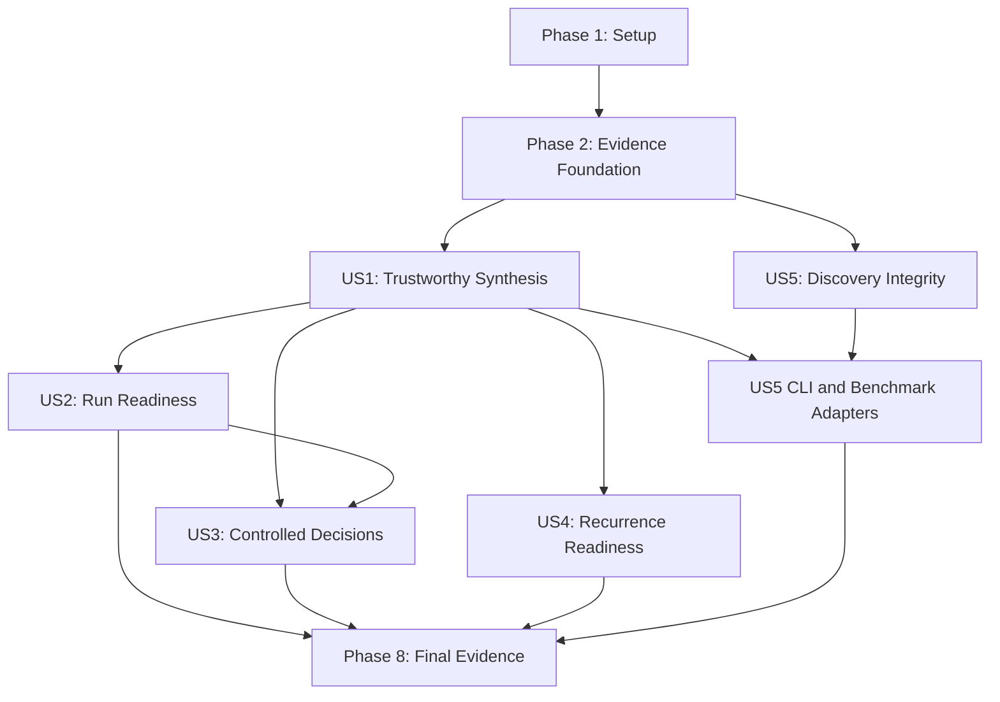

# Tasks: Trustworthy Synthesis Readiness

**Input**: Design documents from `/specs/005-trustworthy-synthesis-readiness/`

**Prerequisites**: [plan.md](plan.md), [spec.md](spec.md), [research.md](research.md), [data-model.md](data-model.md), [quickstart.md](quickstart.md), [contracts/](contracts/)

**Tests**: Tests are required by the project constitution. Test tasks appear before the implementation they validate and must initially demonstrate the missing behavior.

**Organization**: Tasks are grouped by user story so each story can be implemented and verified as an independently valuable increment.

## Format: `[ID] [P?] [Story] Description with file path`

- **[P]**: Can run in parallel because it touches a separate file and does not depend on an incomplete task in the same phase.
- **[Story]**: Maps a task to a user story from [spec.md](spec.md), such as `[US1]`.
- Every task names the file or files it owns. Generated evidence paths are also named where execution is part of the task.

---

## Phase 1: Setup and Configuration

**Purpose**: Establish package boundaries, dependencies, and versioned policy manifests without changing runtime behavior.

- [X] T001 Add `jsonschema` to the development dependency group and make `z3-solver` an explicit runtime dependency in `pyproject.toml`; preserve the existing Python and Rust version constraints.
- [X] T002 Create the evaluation package and its public import boundary in `src/oeis_learn/evaluation/__init__.py`; export no concrete services until their owning tasks are complete.
- [X] T003 [P] Define the versioned Tier 1 preflight and promotion thresholds in `configs/readiness_tier1_v1.json`, including exact-success, assembly-validity, runtime-trap, competence, minimum-coverage, variance, retention, extrapolation, MDL, override, and native-backend qualification rules.
- [X] T004 [P] Define frozen discovery candidate, numerical-validation, canonicalization, and symbolic-promotion settings in `configs/discovery_protocol_v1.json`.
- [X] T005 [P] Define paired inference variants, candidate budgets, common seeds, horizons, and compute ceilings in `configs/experiments/trustworthy_inference_v1.json` and equal-rollout fixed/adaptive training variants in `configs/experiments/trustworthy_curriculum_v1.json`.
- [X] T006 [P] Add shared JSON Schema loading, local `$ref` resolution, and validation fixtures for feature contracts in `tests/contract/conftest.py`.

---

## Phase 2: Foundational Evidence and Input Integrity

**Purpose**: Implement the immutable protocols, checkpoint provenance, and frozen benchmark inputs required by every user story.

**CRITICAL**: No user-story phase may begin until this phase is complete.

### Foundational Tests

- [X] T007 [P] Add unit tests for immutable protocol normalization, canonical JSON hashing, protocol-version rejection, candidate-local seed derivation, and stable seed prefixes in `tests/unit/test_evaluation_protocol.py`.
- [X] T008 [P] Add unit tests for checkpoint-v2 metadata validation, architecture reconstruction, strict-FP32 enforcement, vocabulary/result-profile compatibility, checksum verification, and explicit legacy conversion in `tests/unit/test_checkpoint_loader.py`.
- [X] T009 [P] Add contract tests for valid and invalid frozen benchmark manifests, 20+100 horizon enforcement, source provenance, sequence aliases, result profiles, and leakage fingerprints in `tests/contract/test_benchmark_manifest_contract.py`.
- [X] T010 [P] Add unit tests for duplicate-term, equivalent-program, alias, and train/evaluation leakage detection in `tests/unit/test_benchmark_loader.py`.

### Foundational Implementation

- [X] T011 Define immutable shared entities and enums in `src/oeis_learn/data/models.py` for `EvaluationProtocol`, `CheckpointIdentity`, `BenchmarkManifest`, `BenchmarkSequence`, `SynthesisCandidateRecord`, `StageEvidence`, `ReadinessGateResult`, `ExperimentVariant`, `TaskTrainingState`, `RecurrenceTransition`, and `DiscoveryClaim`; include explicit state values and exact-integer serialization specified by `data-model.md`.
- [X] T012 Implement canonical protocol serialization, SHA-256 identity, supported-version validation, and deterministic candidate-local seed derivation in `src/oeis_learn/evaluation/protocol.py`; candidate `k` must be reproducible independently and budgets 1/8/16 must share the same candidate prefix.
- [X] T013 Implement checkpoint-v2 loading and a deliberate legacy-to-v2 conversion path in `src/oeis_learn/evaluation/checkpoint.py`; reconstruct the encoder/decoder solely from recorded metadata, validate state shapes and vocabulary hash, reject silent defaults, force FP32, and record source checkpoint checksum.
- [X] T014 Implement frozen manifest loading, content hashing, exact-horizon validation, alias handling, and leakage fingerprint comparison in `src/oeis_learn/data/benchmark.py`; expose qualified, excluded, and invalid records separately rather than truncating missing truth data.
- [X] T015 Implement the offline benchmark builder in `scripts/build_benchmark_manifest.py`; source authoritative terms from the existing local OEIS data, preserve source/version metadata, compute leakage fingerprints, and fail when a qualifying sequence lacks 120 exact terms.
- [X] T016 Build and review the initial frozen Stage 1, recurrence-canary, held-out-recurrence, and discovery-validation cohort in `data/benchmarks/trustworthy_synthesis_v1.json`; include 20 observed terms, 100 disjoint unseen terms, family/stage labels, aliases, provenance, and declared scalar or wide result profile.
- [X] T017 Implement append-only run artifact allocation, content-addressed filenames, manifest snapshots, diagnostic-override provenance, and qualification lifecycle states in `src/oeis_learn/tracking/run_manager.py`.
- [X] T018 Implement schema-validated JSON writing as the authoritative record and deterministic Markdown projection helpers in `src/oeis_learn/cli/reporting.py`; prohibit Markdown-only evidence and include artifact hashes in projections.

**Checkpoint**: All later work can rely on reproducible model construction, frozen truth data, immutable protocols, and auditable artifact storage.

---

## Phase 3: User Story 1 - Trustworthy End-to-End Synthesis (Priority: P1) MVP

**Goal**: Make every synthesis entry point execute one real checkpoint-to-verdict workflow with complete candidate lineage.

**Independent Test**: Run interactive and benchmark synthesis with the same checkpoint, protocol, sequence, and seed; verify identical candidates and verdicts, then inject failures at each stage and confirm exact primary classifications.

### Tests for User Story 1

- [X] T019 [P] [US1] Add contract tests for protocol snapshots, candidate lineage, stage timing/evidence, exact observed and unseen outcomes, canonical deduplication, aggregate counts, qualification state, and failure enums in `tests/contract/test_synthesis_evaluation_contract.py` against `contracts/evaluation-protocol.schema.json` and `contracts/synthesis-evaluation.schema.json`.
- [X] T020 [P] [US1] Add unit tests for the candidate state machine in `tests/unit/test_synthesis_pipeline.py`, covering generated, solver-unsatisfiable, solver-timeout, assembly failure, runtime trap, short output, observed mismatch, unseen mismatch, MDL rejection, duplicate candidate, exact success, and unexpected internal-error containment.
- [X] T021 [P] [US1] Add sampler tests for true nucleus filtering, candidate-local generators, deterministic budget prefixes, grammar masking at every token, and reproducible canonical candidate order in `tests/unit/test_sampler_determinism.py`.
- [X] T022 [P] [US1] Add native evaluator tests for per-invocation fuel reset, 10,000-fuel exhaustion, 16 MiB memory enforcement, trap-reason stability, scalar result decoding, and process survival after hostile modules in `crates/oeis_wasm_evaluator/src/sandbox.rs` and `crates/oeis_wasm_evaluator/src/lib.rs`.
- [X] T023 [P] [US1] Add integration tests proving CLI/benchmark semantic parity, corrupt-checkpoint rejection, absent unseen-truth exclusion, no reference-program substitution, and fixed-seed replay in `tests/integration/test_synthesis_entrypoint_parity.py`.

### Implementation for User Story 1

- [X] T024 [US1] Replace split linear/SMT call-site logic with one typed constant-resolution dispatcher in `src/oeis_learn/decoder/constant_solver.py`; return attempted solver chain, SAT/UNSAT/TIMEOUT/ERROR status, constants, grounded program, elapsed time, and diagnostic details without executing or substituting a reference solution on failure.
- [X] T025 [P] [US1] Extend exact-horizon verification in `src/oeis_learn/curriculum/extrapolation.py` to return per-index expected/actual values, first divergence, requested/available horizon, overflow or signedness evidence, and an explicit unqualified result when 100 authoritative unseen terms are unavailable.
- [X] T026 [P] [US1] Extend compactness assessment in `src/oeis_learn/curriculum/mdl_verifier.py` to return input byte size, canonical byte size, target complexity, ratio, threshold, and pass/fail evidence without conflating compactness with correctness.
- [X] T027 [US1] Enforce native per-invocation fuel and memory limits and return stable typed trap evidence in `crates/oeis_wasm_evaluator/src/sandbox.rs` and `crates/oeis_wasm_evaluator/src/lib.rs`; one trapped invocation must not consume another invocation's budget or destabilize the worker pool.
- [X] T028 [US1] Add typed result-profile requests, native backend/limit provenance, exact requested-output-count checks, and stable trap mapping in `src/oeis_learn/sandbox/runner.py`; mark fallback execution diagnostic-only unless it demonstrates limit parity.
- [X] T029 [P] [US1] Make optimization provenance truthful in `src/oeis_learn/sandbox/optimizer.py` and `src/oeis_learn/sandbox/fallback_runner.py`; distinguish real optimizer passes from textual normalization, retain raw and canonical token counts, and never claim unavailable dead-code elimination.
- [X] T030 [US1] Implement candidate-local random generators, actual top-p truncation, stable budget-prefix sampling, and candidate completion metadata in `src/oeis_learn/decoder/sampler.py`; preserve environment-indexed grammar masking and avoid mutating global random state.
- [X] T031 [US1] Implement the sole candidate/cohort evaluation state machine in `src/oeis_learn/evaluation/synthesis.py`; load the frozen protocol/checkpoint/record, generate once up to budget 16, resolve constants, canonicalize and deduplicate, run bounded execution, require exactly 20 observed outputs and 100 unseen outputs, apply MDL, classify one primary failure stage, and persist complete lineage and aggregate metrics.
- [X] T032 [US1] Replace the hard-coded synthesis implementation in `src/oeis_learn/cli/main.py` with a thin adapter over `evaluation.synthesis`; require a checkpoint plus sequence ID or terms, expose protocol/manifest/budget/seed/output arguments from `contracts/cli-interface.md`, and map invalid input, unqualified evaluation, and internal error to distinct exit codes.
- [X] T033 [US1] Replace direct one-candidate post-training evaluation in `scripts/run_long_e2e_benchmark.py` with the shared synthesis service; use the frozen manifest, inference-time constant resolution, exact horizons, native qualification backend, and schema-valid JSON report.
- [X] T034 [US1] Add synthesis JSON and Markdown projections in `src/oeis_learn/cli/reporting.py` that distinguish assembly, execution, observed fit, extrapolation, compactness, and overall qualification; include requested versus unique candidate counts and never label execution alone as success.

**Checkpoint**: User Story 1 is independently usable as a trustworthy checkpoint evaluator and removes all hard-coded or mock production synthesis behavior.

---

## Phase 4: User Story 2 - Evidence-Based Run Readiness (Priority: P1)

**Goal**: Block expensive or promotable runs unless outcome-based preflight, soundness, runtime, coverage, retention, and extrapolation gates pass.

**Independent Test**: Run known-good controls and injected zero-success, syntax-invalid, excessive-trap, low-coverage, extrapolation-failure, and override cases; every failure must block qualification with an actionable reason.

### Tests for User Story 2

- [X] T035 [P] [US2] Add readiness-report contract tests for threshold snapshots, observed values, evidence links, mandatory/advisory severity, overrides, aggregate qualification, and best-run eligibility in `tests/contract/test_readiness_report_contract.py`.
- [X] T036 [P] [US2] Add pure policy unit tests in `tests/unit/test_readiness_policy.py` for boundary values and conjunction behavior across exact success, 100% assembly validity, at most 15% runtime traps, Stage 1 pass rate, competence, minimum coverage, variance, retention, 20+100 extrapolation, MDL, native backend, and compute ceilings.
- [X] T037 [P] [US2] Add progressive-tier failure-injection tests in `tests/unit/test_progressive_readiness.py`; prove that zero exact successes fail Tier 2, low competence or coverage fails Tier 3, syntax and environment failures are separate from runtime traps, and healthy entropy/variance cannot mask outcome failure.
- [X] T038 [P] [US2] Add integration tests for diagnostic override authorization, immutable reason capture, unqualified report marking, and exclusion from graduation/best-run records in `tests/integration/test_readiness_override.py`.

### Implementation for User Story 2

- [X] T039 [US2] Implement pure readiness-policy evaluation in `src/oeis_learn/evaluation/readiness.py`; load versioned thresholds, evaluate every mandatory gate without side effects, retain worst-task evidence, compute qualified/blocked/overridden status, and forbid an override from changing individual gate results.
- [X] T040 [US2] Refactor Tier 2 and Tier 3 checks in `src/oeis_learn/rl/progressive.py` to emit real synthesis and task evidence; require nonzero exact success, enforce competence and minimum coverage, separate assembly failures from bounded runtime traps, and remove elapsed-time-only pass behavior.
- [X] T041 [US2] Expand candidate and training telemetry in `src/oeis_learn/rl/telemetry.py` with per-task generated/unique counts, solver outcomes and latency, assembly failures, trap reasons, observed/unseen/MDL outcomes, selection probability, allocated rollouts, replay events, minimum coverage, and worst-performing tasks.
- [X] T042 [US2] Add qualified, blocked, and diagnostic-override run transitions to `src/oeis_learn/tracking/run_manager.py`; require an operator-provided reason for overrides and prevent overridden or incomplete runs from updating best-run and curriculum-graduation records.
- [X] T043 [US2] Route progressive evidence through the versioned readiness policy in `scripts/run_progressive_validation.py`; write a schema-valid readiness JSON report and a Markdown projection, return nonzero on blocked qualification, and support an explicit diagnostic override without changing the gate verdicts.
- [X] T044 [US2] Add readiness command options and exit-code mapping from `contracts/cli-interface.md` to `src/oeis_learn/cli/main.py`, including policy path, evidence paths, output path, and diagnostic override reason.
- [X] T045 [US2] Add readiness summaries to `src/oeis_learn/cli/reporting.py` that lead with failed mandatory gates, minimum/worst-task metrics, override status, and evidence links rather than mean loss or peak pass rate.

**Checkpoint**: User Story 2 independently prevents a long run from being qualified on permissive or incomplete evidence.

---

## Phase 5: User Story 3 - Controlled Training Decisions (Priority: P2)

**Goal**: Produce fair, bounded, reproducible inference and curriculum comparisons and ensure configured adaptive behavior actually controls production orchestration.

**Independent Test**: Complete all prescribed variants for at least three common seeds; verify shared candidate prefixes, equal rollout budgets, active adaptive events, complete-pair enforcement, uncertainty reporting, and a policy-derived authorization decision.

### Tests for User Story 3

- [X] T046 [P] [US3] Add experiment-manifest contract tests for frozen variants, common seeds, cohort/protocol hashes, budget accounting, completion status, per-seed outcomes, uncertainty, cost, and authorization decision in `tests/contract/test_experiment_manifest_contract.py`.
- [X] T047 [P] [US3] Add allocator unit tests in `tests/unit/test_symple_allocator.py` for exact budget fill, min/max group bounds, deterministic tie-breaking, cold-start probabilities, nonzero exploration, and no budget overrun.
- [X] T048 [P] [US3] Add orchestrator unit tests in `tests/unit/test_curriculum_orchestrator.py` for measured-progress selection, per-task group execution, feedback updates, separate active/replay visits, dormant-task prioritization, retention checks, and append-only allocation events.
- [X] T049 [P] [US3] Add integration tests for candidate-prefix fairness, solver on/off pairing over identical raw candidates, 1/8/16 budget reuse, equal fixed/adaptive rollout totals, three-seed completion, partial-run exclusion, and cost-ceiling enforcement in `tests/integration/test_ablation_fairness.py`.

### Implementation for User Story 3

- [X] T050 [US3] Refactor `EgcaGrpoTrainer` in `src/oeis_learn/rl/trainer.py` to execute an explicitly sized rollout group for exactly one supplied prompt and return structured candidate, reward, solver, replay, and update outcomes; remove internal assumptions that one fixed group size or sampler controls every call.
- [X] T051 [US3] Correct and harden EXP3.S feedback and Ada-G allocation in `src/oeis_learn/curriculum/symple_bandit.py`; fill the exact declared active budget while respecting group bounds, use deterministic tie-breaking, preserve exploration at cold start, and expose before/after weights and probabilities.
- [X] T052 [US3] Separate active visitation, replay visitation, discovery time, last successful verification, and retention sampling in `src/oeis_learn/rl/elite_buffer.py`; dormant priority must not be reset by unrelated access and replay must return the shortest currently verified canonical program.
- [X] T053 [US3] Implement the adaptive execution coordinator in `src/oeis_learn/curriculum/orchestrator.py`; select prompts from measured progress, allocate exact rollout groups, call the trainer, update feedback, sample two dormant replay tasks, measure retention, and emit one append-only event per allocation decision.
- [X] T054 [US3] Implement manifest-driven paired experiments in `src/oeis_learn/evaluation/experiments.py`; cache 16 raw candidates per prompt/seed for inference variants, reuse prefixes for budgets 1/8/16, apply solver on/off after sampling, equalize fixed/adaptive rollout budgets, enforce at least three seeds and 4-hour/24-hour ceilings, and exclude incomplete pairs from promotion.
- [X] T055 [US3] Implement the bounded experiment runner in `scripts/run_trustworthy_ablations.py`; load immutable manifests, resume only incomplete seed/variant units without changing hashes, persist each unit immediately, aggregate dispersion and marginal gain/cost, and request readiness authorization without launching production training.
- [X] T056 [US3] Add experiment and adaptive-training command surfaces from `contracts/cli-interface.md` to `src/oeis_learn/cli/main.py`, including manifest selection, resume, output directory, dry-run budget display, and distinct incomplete/blocked/authorized exit outcomes.
- [X] T057 [US3] Add paired comparison projections in `src/oeis_learn/cli/reporting.py` showing every seed, aggregate dispersion, exact extrapolation delta, marginal candidate-budget gain, wall-clock/evaluation cost, retention, coverage, trap rate, and the readiness policy's authorization decision.

**Checkpoint**: User Story 3 independently answers which existing mechanisms create real gains within the Tier 1 budget and proves adaptive configuration is active rather than decorative.

---

## Phase 6: User Story 4 - Multi-State Recurrence Readiness (Priority: P3)

**Goal**: Generate complete bounded recurrence transitions and verify exact values beyond 64-bit scalar range through the shared synthesis workflow.

**Independent Test**: Use leakage-free training data and qualify Fibonacci, Lucas, Pell, powers of two, and one held-out linear recurrence on 20 observed plus 100 unseen exact terms under resource and compactness limits.

### Tests for User Story 4

- [X] T058 [P] [US4] Add recurrence-tracker unit tests in `tests/unit/test_recurrence_tracker.py` for prior-state snapshots, complete next-state assignment sets, temporary preservation, counter progress, loop backedge gating, local type soundness, and rejection of partial or stale rotations.
- [X] T059 [P] [US4] Add wide-result unit tests in `tests/unit/test_wide_result_profile.py` for zero, positive and negative boundaries, limb carry, sign extension, canonical reconstruction, profile mismatch, and values from all recurrence canaries at the 120-term horizon.
- [X] T060 [P] [US4] Add native four-limb ABI and resource-bound tests in `crates/oeis_wasm_evaluator/src/sandbox.rs` and `crates/oeis_wasm_evaluator/src/lib.rs`, including exact limb ordering, signed reconstruction fixtures, per-call fuel reset, memory limit, and trap classification.
- [X] T061 [P] [US4] Add end-to-end recurrence qualification and leakage rejection tests in `tests/integration/test_recurrence_qualification.py`; require exact 20+100 results, MDL compliance, no equivalent training example, and failure for incomplete rotation, non-progressing loops, memorization, overflow, or fuel exhaustion.

### Implementation for User Story 4

- [X] T062 [US4] Define the `i64_scalar_v1` and exact `i256x4_v1` result profiles and recurrence-compatible productions in `src/oeis_learn/decoder/wat_grammar.py`; keep each profile explicit in protocol/checkpoint metadata and prohibit implicit scalar/wide coercion.
- [X] T063 [US4] Extend the environment-indexed state machine in `src/oeis_learn/decoder/environment_tracker.py` with recurrence frames that track prior-state reads, required next-state writes, temporary initialization, loop-counter progress, branch targets, result arity, and profile types; permit a backedge only after a complete transition.
- [X] T064 [US4] Implement exact four-limb result transport in `crates/oeis_wasm_evaluator/src/sandbox.rs` and expose it through `crates/oeis_wasm_evaluator/src/lib.rs`; preserve all 256 bits, return typed limbs without floating conversion, and retain existing scalar ABI behavior.
- [X] T065 [US4] Decode and validate scalar/four-limb outputs in `src/oeis_learn/sandbox/runner.py`; reconstruct signed exact integers according to the declared profile, reject wrong arity/profile modules, and preserve raw limbs in evidence.
- [X] T066 [US4] Add diverse bounded order-1 and order-2 recurrence demonstrations in `src/oeis_learn/data/synthetic_generator.py`; vary coefficients, initial values, local names, legal state-rotation forms, signed values, and scalar/wide profiles while guaranteeing bounded progress and grammar-emittable programs.
- [X] T067 [US4] Extend leakage screening in `src/oeis_learn/data/benchmark.py` and `scripts/build_benchmark_manifest.py` to compare normalized term fingerprints and canonical program fingerprints across synthetic demonstrations and recurrence evaluation records; fail qualification on exact or equivalent overlap.
- [X] T068 [US4] Wire recurrence profile selection through `src/oeis_learn/evaluation/synthesis.py`; select only the manifest-declared profile, preserve grammar constraints and constant resolution, and apply the same observed, unseen, resource, deduplication, and MDL verdicts as Stage 1 scalar programs.
- [X] T069 [US4] Add the four named recurrence canaries and one reviewed leakage-free held-out linear recurrence, with exact 120-term values and profile metadata, to `data/benchmarks/trustworthy_synthesis_v1.json`.

**Checkpoint**: User Story 4 independently demonstrates exact, compact, bounded recurrence synthesis rather than successful compilation of incorrect loops.

---

## Phase 7: User Story 5 - Defensible Mathematical Discovery (Priority: P3)

**Goal**: Report only canonical, nontrivial, fully evidenced discovery claims and reserve proven status for genuine general symbolic verification.

**Independent Test**: Feed duplicate permutations, scalar multiples, zero coefficients, repeated sequences, reducible subsets, sampled coincidences, a numerical-only identity, and a valid symbolic identity; only one canonical nontrivial identity may reach proven status.

### Tests for User Story 5

- [X] T070 [P] [US5] Add discovery-report and symbolic-definition contract tests for canonical identity, all-nonzero primitive coefficients, disjoint evidence partitions, claim-state transitions, formula/domain provenance, proof evidence, and rejection reasons in `tests/contract/test_discovery_report_contract.py`.
- [X] T071 [P] [US5] Add canonical relation unit tests in `tests/unit/test_relation_identity.py` for tuple permutation, global sign, greatest-common-divisor scaling, repeated sequence IDs, zero coefficients, reducible subsets, alias identities, and stable relation hashes.
- [X] T072 [P] [US5] Add exact numerical-validation tests in `tests/unit/test_numerical_validator.py` for all designated validation and unseen terms, affine index domains, missing terms, sampled-position coincidences, coefficient overflow independence, and residual evidence.
- [X] T073 [P] [US5] Add symbolic-verifier tests in `tests/unit/test_symbolic_prover.py` proving that missing/ambiguous definitions and PSLQ-only evidence remain conjectures, domain mismatches reject, and only a general identity reduced to zero reaches proven status.
- [X] T074 [P] [US5] Add discovery-pipeline integration tests in `tests/integration/test_discovery_pipeline.py` for real checkpoint embeddings, latent proposal only, canonical deduplication, numerical promotion, symbolic promotion, deterministic report order, and JSON/Markdown parity.

### Implementation for User Story 5

- [X] T075 [P] [US5] Create the reviewed symbolic definition registry in `data/benchmarks/symbolic_definitions_v1.json`; include canonical sequence IDs, exact formula text, index domain, affine index transform if any, source provenance, review status, and content hash for each eligible sequence.
- [X] T076 [US5] Implement schema-validated immutable definition loading and formula/domain lookup in `src/oeis_learn/data/symbolic_definitions.py`; reject aliases without canonical resolution, unreviewed definitions, malformed formulas, and domain ambiguity.
- [X] T077 [US5] Implement primitive canonical relation identities and triviality detection in `src/oeis_learn/discovery/relation_identity.py`; sort canonical sequence IDs with coefficients, divide by coefficient GCD, normalize global sign, reject zeros/repeats/aliases/reducible subsets, and produce a stable deduplication hash.
- [X] T078 [US5] Implement exact partitioned relation checking in `src/oeis_learn/discovery/numerical_validator.py`; validate every designated observed-validation and disjoint unseen term, apply declared index transforms and domains, return exact residual evidence, and reject incomplete truth rather than sampling a few indices.
- [X] T079 [US5] Restrict `src/oeis_learn/discovery/pslq_solver.py` to coefficient proposal/confirmation; normalize returned vectors through relation identity, require all nonzero primitive coefficients, and remove any direct transition to proven status.
- [X] T080 [US5] Refactor `src/oeis_learn/discovery/symbolic_prover.py` to return structured proof evidence; require reviewed definitions for every sequence, construct the general indexed relation over the common domain, and mark proven only when independent simplification establishes exact equality.
- [X] T081 [US5] Implement shared checkpoint-to-claim orchestration in `src/oeis_learn/discovery/pipeline.py`; extract real embeddings, propose latent candidates, canonicalize/deduplicate, run coefficient confirmation, exact validation, and optional symbolic proof in order, preserving rejected and conjectural claims with reasons.
- [X] T082 [US5] Replace mock discovery behavior in `src/oeis_learn/cli/main.py` and direct benchmark discovery in `scripts/run_long_e2e_benchmark.py` with the shared discovery pipeline and arguments from `contracts/cli-interface.md`.
- [X] T083 [US5] Add schema-valid discovery JSON and deterministic Markdown projection in `src/oeis_learn/cli/reporting.py`; group latent candidates, numerical conjectures, symbolic proofs, and rejections separately and collapse canonical duplicates to one claim.

**Checkpoint**: User Story 5 independently prevents trivial or numerical-only relations from being published as formal theorems.

---

## Phase 8: Polish and Cross-Cutting Validation

**Purpose**: Verify contract conformance, constitutional limits, backward compatibility, operational documentation, and the bounded evidence package needed for a production-run decision.

- [X] T084 [P] Add concise operator documentation for checkpoint conversion, frozen manifests, synthesis evaluation, readiness reports, diagnostic overrides, bounded ablations, recurrence profiles, and discovery statuses in `README.md` and `runs/README.md`.
- [X] T085 [P] Add explicit command and expected-outcome examples for all new CLI surfaces to `specs/005-trustworthy-synthesis-readiness/quickstart.md`, keeping production-run launch outside this feature.
- [X] T086 Run all feature contract, unit, and integration tests described in `specs/005-trustworthy-synthesis-readiness/quickstart.md`; fix only feature-related failures and record any unrelated pre-existing failures in `reports/trustworthy_synthesis_readiness.md`.
- [X] T087 Run `cargo test` for the native evaluator and the existing full Python test suite; verify scalar backward compatibility, four-limb exactness, sandbox limits, and no regression in prior phases, recording commands and results in `reports/trustworthy_synthesis_readiness.md`.
- [X] T088 Execute the progressive readiness suite with known-good and injected-failure fixtures via `scripts/run_progressive_validation.py`; preserve the contract-valid report and confirm each mandatory failure blocks qualification while diagnostic override remains unqualified.
- [X] T089 Execute the 1,000-candidate qualification smoke evaluation through `src/oeis_learn/evaluation/synthesis.py`; verify complete lineage, 100% grammar-constrained assembly validity, at most 15% runtime traps, zero host instability, and record immutable artifact hashes in `reports/trustworthy_synthesis_readiness.md`.
- [X] T090 Execute the three-seed paired inference and fixed/adaptive curriculum manifests with `scripts/run_trustworthy_ablations.py`; confirm all pairs complete within per-trial and total Tier 1 ceilings, then record every seed, dispersion, marginal gain/cost, retention, coverage, and readiness decision in `reports/trustworthy_synthesis_readiness.md`.
- [X] T091 Review the final evidence package against all success criteria in `specs/005-trustworthy-synthesis-readiness/spec.md`; record each criterion as passed, blocked, or not yet demonstrated in `reports/trustworthy_synthesis_readiness.md`, and do not authorize a production-length run unless every mandatory readiness gate passes.

---

## Dependencies and Execution Order

### Phase Dependencies

- **Phase 1 (Setup)**: Starts immediately.
- **Phase 2 (Foundation)**: Depends on Phase 1 and blocks every user story.
- **Phase 3 (US1)**: Depends on Phase 2; this is the MVP and supplies synthesis evidence to all later stories.
- **Phase 4 (US2)**: Depends on US1 because readiness evaluates shared synthesis reports.
- **Phase 5 (US3)**: Depends on US1 for paired inference and US2 for authorization decisions.
- **Phase 6 (US4)**: Depends on US1 for shared evaluation; its grammar/native work can proceed after Phase 2, but final recurrence qualification depends on US1.
- **Phase 7 (US5)**: Depends on Phase 2 only and can proceed in parallel with US2-US4; its final CLI/benchmark adapters should merge after US1 adapters establish shared reporting conventions.
- **Phase 8 (Polish)**: Depends on all selected user stories; T090 additionally depends on US2 and US3, and T091 depends on all validation tasks.

### User Story Dependency Graph



### Within Each User Story

1. Add contract, unit, native, and integration tests before implementation.
2. Implement pure data and policy behavior before orchestration.
3. Integrate adapters only after the shared service passes focused tests.
4. Run the story's independent test before starting dependent story work.

---

## Parallel Execution Examples

### Foundation

```text
T007 protocol tests | T008 checkpoint tests | T009 manifest contract tests | T010 leakage tests
After T011: T012 protocol implementation | T013 checkpoint implementation | T014 benchmark loader
```

### User Story 1

```text
T019 contract tests | T020 state-machine tests | T021 sampler tests | T022 native tests | T023 parity tests
After T024-T030: T032 CLI adapter | T033 benchmark adapter (both depend on T031 shared workflow)
```

### User Story 2

```text
T035 readiness contract | T036 policy tests | T037 progressive tests | T038 override integration
After T039: T040 progressive evidence | T042 run lifecycle; then T043-T045 adapters and reporting
```

### User Story 3

```text
T046 experiment contract | T047 allocator tests | T048 orchestrator tests | T049 fairness integration
After T050-T053: T054 experiment service; then T055 runner | T056 CLI | T057 reporting
```

### User Story 4

```text
T058 tracker tests | T059 wide-profile tests | T060 native ABI tests | T061 qualification integration
After T062-T065: T066 demonstrations | T067 leakage checks; then T068-T069 final qualification data path
```

### User Story 5

```text
T070 report contract | T071 relation tests | T072 numerical tests | T073 proof tests | T074 integration
After T075-T080: T081 pipeline; then T082 adapters | T083 reporting
```

---

## Implementation Strategy

### MVP First

Complete Phases 1-3 first. The MVP is a trustworthy shared checkpoint evaluator that removes hard-coded synthesis, applies all post-processing consistently, and emits reproducible candidate-level evidence. This delivers value before changing training or recurrence behavior.

### Incremental Delivery

1. **Evidence foundation**: Freeze protocols, checkpoints, cohorts, and artifact identity.
2. **Trustworthy synthesis**: Establish one checkpoint-to-verdict path and entry-point parity.
3. **Readiness gates**: Prevent permissive or overridden results from qualifying.
4. **Controlled decisions**: Activate adaptive orchestration and run fair bounded comparisons.
5. **Recurrence progression**: Add complete state rotation and exact wide outputs.
6. **Discovery integrity**: Separate proposals, conjectures, and actual symbolic proofs.
7. **Final evidence**: Run smoke, ablation, and constitutional gates; authorize no long run without complete passing evidence.

### Completion Discipline

- Do not launch a production-length run as part of these tasks.
- Do not weaken exactness, horizons, MDL, grammar, fuel, memory, FP32, or Tier 1 constraints to make a gate pass.
- Do not overwrite or reinterpret Run 007 artifacts; all new evidence is versioned and append-only.
- Do not promote partial paired experiments, diagnostic overrides, numerical-only relations, or successful execution without exact extrapolation.
