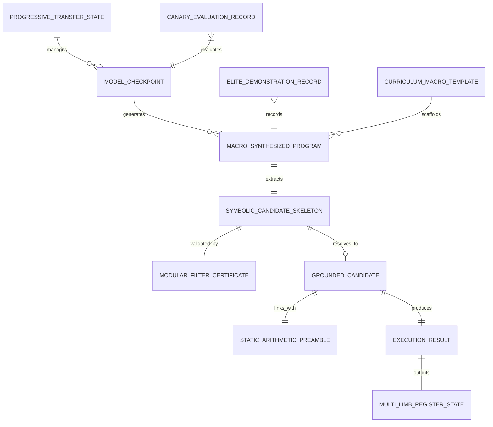

# Data Model: 4 × i64 Multi-Limb Migration & Curriculum Scaling

**Feature Branch**: `006-multilimb-curriculum-scaling`  
**Date**: 2026-09-06  
**Status**: Completed Phase 1 Design

---

## Entity Relationship Overview

---

## 1. MultiLimbRegisterState

Represents a four-limb 255-bit signed integer in two's-complement little-endian layout.

- **`limbs`**: `Tuple[int, int, int, int]` (mandatory)
  - Four 64-bit unsigned integers: $[l_0, l_1, l_2, l_3]$.
  - Invariant: $0 \le l_j < 2^{64}$ for each $j \in \{0, 1, 2, 3\}$.
- **`signed_value`**: `int` (derived / property)
  - Mathematical signed integer $Y \in [-2^{255}, 2^{255}-1]$.
  - Reconstructed via:
    $$U = \sum_{j=0}^3 (l_j \bmod 2^{64}) 2^{64j}, \quad Y = \begin{cases} U - 2^{256} & \text{if } U \ge 2^{255} \\ U & \text{if } U < 2^{255} \end{cases}$$
- **`is_negative`**: `bool` (derived)
  - True if $l_3 \ge 2^{63}$ (highest bit set).
- **`bit_length`**: `int` (derived)
  - Minimal bit width required to represent `abs(signed_value)`.

---

## 2. MacroSynthesizedProgram

Represents a synthesized candidate program operating at high-level multi-limb macro abstraction.

- **`program_id`**: `str` (UUID or hash)
- **`macro_wat`**: `str` (source WAT containing macro instructions like `i256.add`, `i256.sub`, `i256.mul_scalar`, `i256.const`)
- **`result_profile`**: `Literal["i256x4_v1", "i64_scalar_v1"]` (default `"i256x4_v1"`)
- **`token_count`**: `int` (token count of macro body, invariant: $\le 40$ tokens for Stage 1–3 recurrences)
- **`template_stage`**: `Optional[Literal["STAGE_1", "STAGE_2", "STAGE_3", "STAGE_4"]]`
- **`lowered_wat`**: `str` (expanded WAT linking static arithmetic preamble functions)
- **`mdl_ratio`**: `float` (Minimum Description Length ratio relative to sequence complexity, constraint: $\le 1.20$)

---

## 3. StaticArithmeticPreamble

Represents the pre-compiled, verified WebAssembly math library linked into each module.

- **`version`**: `str` (e.g. `"1.0.0"`)
- **`fuel_costs`**: `Dict[str, int]`
  - `$i256_add`: 55 fuel units (52 instructions)
  - `$i256_sub`: 56 fuel units (53 instructions)
  - `$mul64_wide`: 60 fuel units (60 instructions)
  - `$i256_mul_scalar`: 271 fuel units (268 instructions)
- **`memory_limit_bytes`**: `int` (invariant: $0$, zero linear memory enforcement)
- **`wat_code`**: `str` (pre-verified WAT module containing pure value-stack functions)

---

## 4. SymbolicCandidateSkeleton

Represents an ungrounded candidate program AST containing numerical constant placeholders.

- **`raw_wat`**: `str` (WAT containing `i64.const_?` placeholders)
- **`placeholder_count`**: `int` ($k \ge 1$)
- **`placeholder_indices`**: `List[int]` (token positions of placeholders)
- **`is_linear`**: `bool` (True if placeholders only appear in affine/linear combinations)
- **`recurrence_order`**: `int` (order $k \in \{1, 2, 3, 4\}$ for linear recurrence skeletons)
- **`basis_signatures`**: `List[str]` (structural register update signatures)

---

## 5. ModularFilterCertificate (Tier 1)

Represents the finite-field rank analysis certificate produced by the Mersenne-61 fast filter.

- **`status`**: `Literal["CONSISTENT", "INCONSISTENT", "UNDERDETERMINED"]`
- **`prime`**: `int` ($2^{61}-1 = 2305843009213693951$)
- **`augmented_rank`**: `int` ($\text{rank}(\bar{M})$)
- **`coefficient_rank`**: `int` ($\text{rank}(\bar{A})$)
- **`unknown_count`**: `int` ($k$)
- **`elapsed_microseconds`**: `float` (invariant: $< 500\,\mu\text{s}$)
- **`penalty_reward`**: `float` ($-0.50$ if `INCONSISTENT` or `UNDERDETERMINED`, $0.0$ if `CONSISTENT`)

---

## 6. GroundedCandidate

Represents a program skeleton whose constant placeholders have been grounded into concrete integers.

- **`skeleton_id`**: `str`
- **`constants`**: `List[int]` (grounded integer coefficients $c_j \in [-1000, 1000]$)
- **`solver_tier`**: `Literal["TIER1_MODULAR_M61", "TIER2_DIXON_LIFTING", "TIER3_Z3_QFNIA"]`
- **`is_sat`**: `bool`
- **`solve_duration_ms`**: `float`
- **`grounded_wat`**: `str` (WAT with `i64.const <val>` spliced into placeholders)
- **`certificate`**: `ModularFilterCertificate`

---

## 7. ProgressiveTransferState

Represents the multi-phase continual learning state migrating from Run 010 scalar weights.

- **`base_checkpoint`**: `str` (e.g. `checkpoints/model_epoch_050.v2.pt`)
- **`current_phase`**: `Literal["PHASE1_SURGERY", "PHASE2_WARMUP", "PHASE3_BRIDGE_SFT", "PHASE4_REANCHOR", "PHASE5_RL"]`
- **`step_count`**: `int`
- **`active_learning_rates`**: `Dict[str, float]`
  - Phase 2: `{"new_embeddings": 1e-4, "backbones": 0.0}`
  - Phase 3: `{"encoder_top2": 1e-5, "decoder": 5e-5, "new_heads": 1e-4}`
- **`frozen_modules`**: `List[str]`
- **`transition_gate_metrics`**: `Dict[str, float]`
  - `advantage_collapse_rate`: `float` (target: $\le 0.15$)
  - `grammar_validity`: `float` (target: $\ge 0.985$)
  - `candidate_pass_rate`: `float` (target: $\ge 0.75$)
- **`gate_passed`**: `bool`

---

## 8. CurriculumMacroTemplate

Represents structural code scaffolds for Stages 1 through 4.

- **`stage`**: `Literal["STAGE_1", "STAGE_2", "STAGE_3", "STAGE_4"]`
- **`name`**: `str` (e.g. `"ORDER_2_LINEAR_RECURRENCE"`, `"HOLONOMIC_FACTORIAL_LOOP"`)
- **`register_layout`**: `Dict[str, str]` (mapping register names `$a0..$a3`, `$b0..$b3`, `$t0..$t3` to types)
- **`loop_structure`**: `Literal["NONE", "SINGLE_ACCUMULATOR", "SLIDING_WINDOW_2", "SLIDING_WINDOW_3", "SLIDING_WINDOW_4", "NESTED_DIVISOR"]`
- **`supported_orders`**: `List[int]`

---

## 9. CanaryEvaluationRecord

Represents qualification evidence for the 6 landmark canaries over 120 total terms.

- **`sequence_id`**: `Literal["A000217", "A000290", "A000079", "A000045", "A000032", "A000129"]`
- **`observed_match_20`**: `bool` (must be True)
- **`unseen_match_100`**: `bool` (must be True)
- **`overflow_detected`**: `bool` (must be False)
- **`max_fuel_consumed`**: `int` (invariant: $\le 10{,}000$)
- **`output_limbs_at_100`**: `Tuple[int, int, int, int]`
- **`verdict`**: `Literal["EXTRAPOLATING_SUCCESS", "FAILED_VERIFICATION", "OVERFLOW_TRAP", "FUEL_TRAP"]`

---

## 10. EliteDemonstrationRecord

Represents a high-reward multi-limb trajectory cached in the Elite Demonstration Buffer.

- **`sequence_id`**: `str`
- **`stage`**: `str`
- **`token_ids`**: `List[int]`
- **`reward`**: `float` ($1.00$)
- **`source`**: `Literal["CANONICAL_SEED", "DISCOVERED_ROLLOUT"]`
- **`usage_count`**: `int` (number of times injected to prevent advantage collapse)
