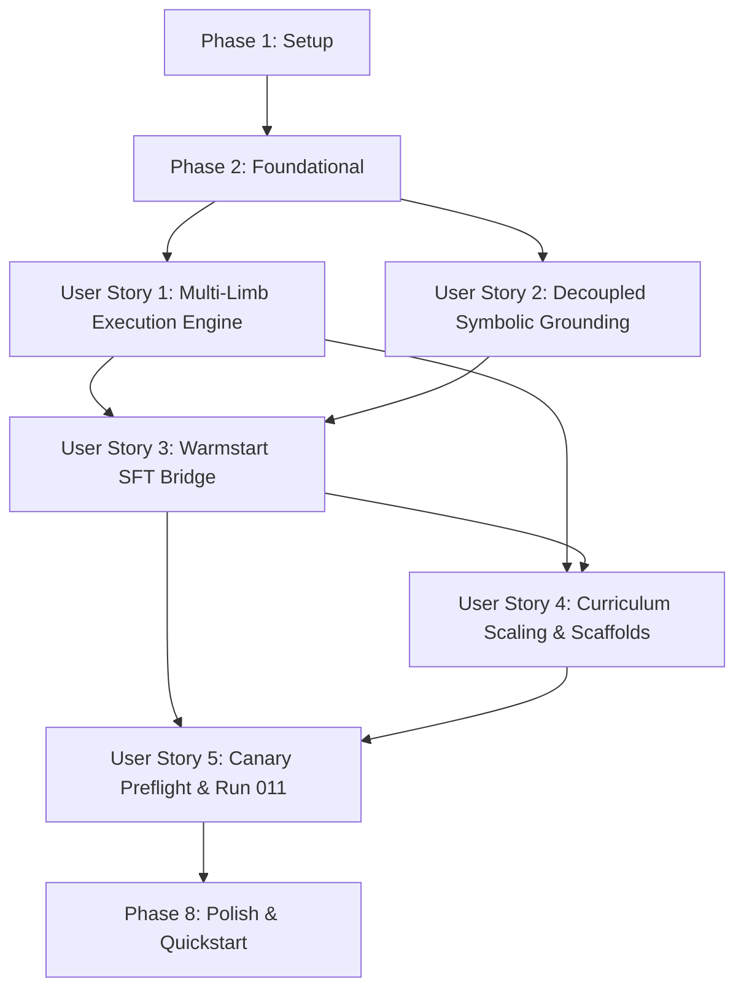

# Tasks: 4 × i64 Multi-Limb Migration, Corpus-Informed Curriculum Scaling, & Warm-Started Training Plan

**Input**: Design documents from `/specs/006-multilimb-curriculum-scaling/`

**Prerequisites**: [plan.md](plan.md), [spec.md](spec.md), [research.md](research.md), [data-model.md](data-model.md), [quickstart.md](quickstart.md), [contracts/](contracts/)

**Tests**: Required by project constitution (TDD foundation). Test tasks appear before the implementation they validate and must initially demonstrate failing behavior.

**Organization**: Tasks are grouped by user story so each story can be implemented and verified as an independently valuable increment.

## Format: `[ID] [P?] [Story] Description with file path`

- **[P]**: Can run in parallel (different files, no dependencies)
- **[Story]**: Which user story this task belongs to (e.g., `[US1]`, `[US2]`, `[US3]`)
- Every task includes exact file paths in its description.

---

## Phase 1: Setup (Shared Infrastructure)

**Purpose**: Establish configuration profiles, static WebAssembly preamble assets, and test fixtures without altering existing runtime behavior.

- [X] T001 Define multi-limb configuration and profile defaults in `configs/readiness_tier1_v1.json` for `i256x4_v1` result profile, zero-linear-memory enforcement, and 10,000 instruction fuel limit
- [X] T002 [P] Embed the verified static arithmetic WebAssembly preamble in `src/oeis_learn/sandbox/preamble.wat` matching `specs/006-multilimb-curriculum-scaling/contracts/multi-limb-preamble.wat`
- [X] T003 [P] Configure production Run 011 training specification in `configs/train_run011.yaml` with phased durations (warmup, joint bridge, GRPO), learning rates, EDB settings, and canary evaluation intervals
- [X] T004 [P] Add contract test loading and schema validation fixtures for `multi-limb-preamble.wat`, `macro-instruction-set.md`, `symbolic-grounding.schema.json`, `warmstart-transfer-config.schema.json`, and `canary-benchmark.schema.json` in `tests/contract/conftest.py`

---

## Phase 2: Foundational (Blocking Prerequisites)

**Purpose**: Core data models, register representations, and contract verifications that MUST be complete before any user story can be implemented.

**⚠️ CRITICAL**: No user story work can begin until this phase is complete.

### Foundational Tests

- [X] T005 [P] Add unit tests for `MultiLimbRegisterState` two's-complement reconstruction and bit-length computation across positive, negative, and edge-case values in `tests/unit/test_multi_limb_arithmetic.py`
- [X] T006 [P] Add contract tests for macro instruction set specification and lowering invariants against `specs/006-multilimb-curriculum-scaling/contracts/macro-instruction-set.md` in `tests/contract/test_macro_instruction_lowering.py`

### Foundational Implementation

- [X] T007 Define data models for `MultiLimbRegisterState`, `MacroSynthesizedProgram`, `StaticArithmeticPreamble`, `SymbolicCandidateSkeleton`, `ModularFilterCertificate`, `GroundedCandidate`, `ProgressiveTransferState`, `CurriculumMacroTemplate`, `CanaryEvaluationRecord`, and `EliteDemonstrationRecord` in `src/oeis_learn/data/models.py`
- [X] T008 [P] Implement static arithmetic preamble loading, instruction cost accounting, and memory limit verification in `src/oeis_learn/sandbox/preamble.py`

**Checkpoint**: Foundation ready - user story implementation can now begin.

---

## Phase 3: User Story 1 - Multi-Limb Precision Execution and Truncation-Free Synthesis (Priority: P1) 🎯 MVP

**Goal**: Execute candidate programs in 255-bit signed multi-limb precision (`i256x4_v1`) using compact value-stack macro operations lowered to a static preamble with zero linear memory, eliminating 64-bit overflow truncation.

**Independent Test**: Evaluate candidate execution on Fibonacci (`A000045`), Lucas (`A000032`), Powers of 2 (`A000079`), and Pell (`A000129`) through 100 terms; verify that multi-limb execution produces exact mathematical integers without sign flipping, bit wrapping, or runtime crashes.

### Tests for User Story 1

- [X] T009 [P] [US1] Add unit tests for `$i256_add`, `$i256_sub`, `$mul64_wide`, and `$i256_mul_scalar` in `crates/oeis_wasm_evaluator/src/sandbox.rs` verifying 4-limb value stack calculations, fuel bounding, and zero linear memory
- [X] T010 [P] [US1] Add contract tests for preamble verification and opcode linking in `tests/contract/test_preamble_contract.py`
- [X] T011 [P] [US1] Add integration tests for 100-term overflow-free execution on Fibonacci, Lucas, Pell, and Powers of 2 in `tests/integration/test_recurrence_qualification.py`

### Implementation for User Story 1

- [X] T012 [US1] Implement native quad-limb value-stack execution (`(result i64 i64 i64 i64)`) with strict 10,000 fuel bounding and 0 linear memory in `crates/oeis_wasm_evaluator/src/sandbox.rs`
- [X] T013 [US1] Expose quad-limb execution results (`wide_output: Vec<[i64; 4]>`) through the PyO3 module interface in `crates/oeis_wasm_evaluator/src/lib.rs`
- [X] T014 [US1] Implement macro lowering engine in `src/oeis_learn/sandbox/lowering.py` translating `i256.add`, `i256.sub`, `i256.mul_scalar`, and `i256.const` into static preamble calls and literal expansions
- [X] T015 [US1] Update `WasmRunner.run_single` and `run_batch` in `src/oeis_learn/sandbox/runner.py` to support macro lowering, `i256x4_v1` profile execution, exact two's-complement decoding, and execution error attribution
- [X] T016 [US1] Extend environment-indexed grammar in `src/oeis_learn/decoder/wat_grammar.py` with multi-limb macro tokens, quad-limb registers (`$a0`..`$t3`), and signature rules for `(result i64 i64 i64 i64)`

**Checkpoint**: At this point, User Story 1 is fully functional and testable independently. Candidate programs execute in exact 255-bit precision with 0 linear memory.

---

## Phase 4: User Story 2 - High-Throughput Decoupled Symbolic Grounding (Priority: P1)

**Goal**: Ground undetermined constants in candidate program skeletons via a decoupled three-tier solver (Mersenne-61 fast modular filter $<0.5\text{ ms}$, Dixon 1-step Diophantine solver $<1.0\text{ ms}$, Z3 tactical QF_NIA $<240\text{ ms}$), completely eliminating SMT bit-blasting (`QF_BV`) timeouts.

**Independent Test**: Feed 1,000 multi-limb candidate skeletons with constant placeholders into the grounding pipeline; verify that inconsistent skeletons are rejected in under 0.5 ms, linear recurrence skeletons are resolved in under 1 ms, and valid coefficients match ground-truth integers.

### Tests for User Story 2

- [X] T017 [P] [US2] Add unit tests for Mersenne-61 limb-folding projection ($\text{fold}_{61}(u)$) and Gaussian elimination over $\mathbb{F}_{2^{61}-1}$ in `tests/unit/test_mersenne61_filter.py`
- [X] T018 [P] [US2] Add unit tests for Dixon 1-step bounded Diophantine solving over $\mathbb{Z}$ in `tests/unit/test_dixon_diophantine_solver.py`
- [X] T019 [P] [US2] Add contract tests for symbolic grounding schema against `specs/006-multilimb-curriculum-scaling/contracts/symbolic-grounding.schema.json` in `tests/contract/test_symbolic_grounding_contract.py`
- [X] T020 [P] [US2] Add integration tests comparing three-tier solver throughput and rejection speed against legacy SMT bit-blasting in `tests/integration/test_symbolic_grounding_pipeline.py`

### Implementation for User Story 2

- [X] T021 [US2] Implement Mersenne-61 fast modular rank filter in `src/oeis_learn/decoder/mersenne61_filter.py` with entry-wise limb folding, row reduction, and Rouché-Capelli consistency verification
- [X] T022 [US2] Implement Dixon 1-step bounded Diophantine solver in `src/oeis_learn/decoder/dixon_solver.py` for linear recurrence skeletons with coefficients bounded in $[-1000, 1000]$ and exact certificate check over $\mathbb{Z}$
- [X] T023 [US2] Implement tactical Z3 QF_NIA non-linear solver in `src/oeis_learn/decoder/qfnia_solver.py` using tactic `(then simplify solve-eqs purify-arith (try-for qfnia 240))` and interval constraints
- [X] T024 [US2] Integrate the three tiers into unified dispatcher `solve_constants` in `src/oeis_learn/decoder/constant_solver.py`, returning complete lineage, filter certificates, and negative grounding penalties for invalid candidates

**Checkpoint**: At this point, User Stories 1 AND 2 both work independently. Skeletons resolve coefficients in sub-millisecond time.

---

## Phase 5: User Story 3 - Progressive Warm-Started Continual Learning (Priority: P2)

**Goal**: Warm-start the multi-limb policy from the Run 010 Epoch 50 checkpoint via Strategy C (Progressive SFT Bridge Transfer) without advantage collapse or representational forgetting.

**Independent Test**: Perform vocabulary surgery and embedding warmup on the Run 010 checkpoint, run the joint SFT bridge phase, and verify that the transition gate achieves $\le 15\%$ advantage collapse rate, $\ge 98.5\%$ syntactic validity, and $\ge 75\%$ pass rate before initiating reinforcement learning.

### Tests for User Story 3

- [X] T025 [P] [US3] Add unit tests for convex hull projection initialization of $E_{\text{in}}$, unembedding norm calibration of $W_{\text{out}}$, and logit soft-capping in `tests/unit/test_vocabulary_surgery.py`
- [X] T026 [P] [US3] Add contract tests for warmstart transfer configuration against `specs/006-multilimb-curriculum-scaling/contracts/warmstart-transfer-config.schema.json` in `tests/contract/test_warmstart_transfer_contract.py`
- [X] T027 [P] [US3] Add integration tests for Transition Gate criteria evaluation (ACR $\le 15\%$, grammar $\ge 98.5\%$, pass rate $\ge 75\%$) in `tests/integration/test_transition_gate.py`

### Implementation for User Story 3

- [X] T028 [US3] Implement vocabulary expansion with convex hull semantic projection and unembedding norm calibration in `src/oeis_learn/decoder/vocabulary_surgery.py`
- [X] T029 [US3] Add hyperbolic tangent logit soft-capping ($C_{\text{cap}} = 30.0$) to `WatTransformerDecoder.forward()` in `src/oeis_learn/decoder/transformer_decoder.py`
- [X] T030 [US3] Implement Phase 2 embedding warmup training routine (1,500 steps, frozen encoder & decoder backbones) in `src/oeis_learn/rl/sft_trainer.py`
- [X] T031 [US3] Implement Phase 3 joint SFT bridge training routine (5,000 steps, discriminative learning rates) in `src/oeis_learn/rl/sft_trainer.py`
- [X] T032 [US3] Implement Transition Gate evaluator in `src/oeis_learn/curriculum/transition_gate.py` computing ACR, grammar validity, and pass rate on held-out multi-limb data
- [X] T033 [US3] Implement Strategy C CLI workflow in `src/oeis_learn/cli/train_warmstart.py` orchestrating surgery, warmup, joint SFT, gate evaluation, and reference policy re-anchoring

**Checkpoint**: At this point, the pre-trained checkpoint is successfully transitioned to multi-limb syntax, passing the Transition Gate.

---

## Phase 6: User Story 4 - Corpus-Informed Multi-Stage Curriculum Scaling (Priority: P2)

**Goal**: Support macro-scaffolding templates for Stages 1 through 4, negative integer handling, flexible extrapolation margins, and a 20,000-demonstration dataset.

**Independent Test**: Generate 20,000 multi-limb demonstrations; verify 100% execution pass rate; verify macro-scaffolding generation for Stages 1–4 and flexible extrapolation on sequences with $N_{\text{avail}} < 120$.

### Tests for User Story 4

- [X] T034 [P] [US4] Add unit tests for macro-scaffolding templates across Stages 1 through 4 in `tests/unit/test_macro_templates.py`
- [X] T035 [P] [US4] Add unit tests for signed demonstration generation and negative coefficient handling in `tests/unit/test_synthetic_signed_data.py`
- [X] T036 [P] [US4] Add unit tests for flexible extrapolation horizon calculation and margin enforcement in `tests/unit/test_extrapolation_verifier.py`

### Implementation for User Story 4

- [X] T037 [US4] Implement macro-scaffolding code templates for Stages 1, 2 ($k=1..4$), 3 (holonomic), and 4 (nested divisor loops) in `src/oeis_learn/curriculum/macro_templates.py`
- [X] T038 [US4] Extend synthetic dataset generator in `src/oeis_learn/data/synthetic_generator.py` to emit 20,000 verified multi-limb demonstrations balanced across Stages 1–3 with signed coefficients ($c_i \in [-3, 3]$) and alternating signs
- [X] T039 [US4] Update flexible extrapolation verifier in `src/oeis_learn/curriculum/extrapolation.py` to evaluate over $\min(100, N_{\text{avail}}-N_{\text{obs}})$ with a mandatory margin of $\max(15, 0.4 \times N_{\text{avail}})$ for general OEIS sequences
- [X] T040 [US4] Implement Elite Demonstration Buffer (EDB) seeding with canonical 4-limb programs and rollout injection into GRPO prompt groups in `src/oeis_learn/rl/elite_buffer.py`
- [X] T041 [US4] Update EXP3.S task curriculum bandit in `src/oeis_learn/curriculum/scheduler.py` with uniform weight recalibration and exploration floor $\gamma_{\text{floor}} = 0.25$

**Checkpoint**: At this point, curriculum scaling is active across all 4 stages with anti-collapse protection.

---

## Phase 7: User Story 5 - Canary Verification and Production Run Launch (Priority: P3)

**Goal**: Implement automated preflight qualification on 6 landmark canaries over 120 terms and launch production Run 011 with EGCA-GRPO.

**Independent Test**: Run canary preflight qualification tool; confirm all 6 canaries pass 100-term extrapolation; launch Run 011 training trial and verify non-zero advantage variance.

### Tests for User Story 5

- [X] T042 [P] [US5] Add contract tests for canary benchmark schema against `specs/006-multilimb-curriculum-scaling/contracts/canary-benchmark.schema.json` in `tests/contract/test_canary_benchmark_contract.py`
- [X] T043 [P] [US5] Add integration tests for automated canary preflight qualification across the 6 landmark sequences in `tests/integration/test_canary_qualification.py`

### Implementation for User Story 5

- [X] T044 [US5] Implement automated canary preflight qualification harness in `src/oeis_learn/cli/evaluate_canaries.py` executing 120-term evaluation on the 6 landmark canaries (`A000217`, `A000290`, `A000079`, `A000045`, `A000032`, `A000129`)
- [X] T045 [US5] Implement production Run 011 launcher in `src/oeis_learn/cli/train_run011.py` with preflight canary gate check, warm-started policy loading, EDB injection, and telemetry logging to `runs/011_multilimb_256bit_production/`
- [X] T046 [US5] Extend training telemetry and reporting in `src/oeis_learn/tracking/run_manager.py` to record multi-limb advantage collapse rate, modular filter rejection rate, Diophantine solve duration, and per-stage competence

**Checkpoint**: All user stories complete. Production Run 011 is authorized and launched.

---

## Phase 8: Polish & Cross-Cutting Concerns

**Purpose**: Documentation, end-to-end regression validation, performance optimizations, and quickstart execution.

- [X] T047 [P] Update developer and architecture documentation in `README.md` and `docs/multi_limb_synthesis.md` documenting the $4 \times i64$ execution model, macro instructions, and three-tier grounding
- [X] T048 [P] Add end-to-end multi-limb regression tests in `tests/integration/test_real_data_e2e.py` covering real OEIS sequences evaluated in `i256x4_v1` mode
- [X] T049 Optimize macro lowering string substitutions and token buffering in `src/oeis_learn/sandbox/lowering.py` to maintain $> 500$ module evaluations per second throughput
- [X] T050 Execute full quickstart validation scenarios A through E in `specs/006-multilimb-curriculum-scaling/quickstart.md` and verify all tests pass

---

## Dependencies & Execution Order

### Phase Dependencies

- **Setup (Phase 1)**: No dependencies - can start immediately
- **Foundational (Phase 2)**: Depends on Setup completion - BLOCKS all user stories
- **User Story 1 (Phase 3, P1)**: Depends on Foundational completion. Delivers the core multi-limb execution engine (MVP)
- **User Story 2 (Phase 4, P1)**: Depends on Foundational completion. Can proceed in parallel with US1 or immediately follow it
- **User Story 3 (Phase 5, P2)**: Depends on US1 (macro lowering and grammar) and US2 (grounding)
- **User Story 4 (Phase 6, P2)**: Depends on US1 (multi-limb execution) and US3 (bridge models)
- **User Story 5 (Phase 7, P3)**: Depends on US3 (warmstart checkpoint) and US4 (curriculum scaling)
- **Polish (Final Phase 8)**: Depends on all user stories being complete

### User Story Dependencies



### Within Each User Story

- Tests MUST be written and fail before implementation begins
- Data models before services
- Low-level engines (WASM preamble, lowering) before high-level dispatchers
- Core logic before CLI entry points
- Story complete and independently verified before progressing

### Parallel Opportunities

- **Phase 1**: T002, T003, T004 can run in parallel
- **Phase 2**: T005, T006, T008 can run in parallel
- **Phase 3 (US1)**: T009, T010, T011 test creation can run in parallel
- **Phase 4 (US2)**: T017, T018, T019, T020 test creation can run in parallel; T021 (M61), T022 (Dixon), T023 (Z3) can be developed in parallel
- **Phase 5 (US3)**: T025, T026, T027 test creation can run in parallel
- **Phase 6 (US4)**: T034, T035, T036 test creation can run in parallel
- **Phase 7 (US5)**: T042, T043 test creation can run in parallel
- **Phase 8**: T047, T048 can run in parallel

---

## Parallel Example: User Story 1

```bash
# Launch test creation for User Story 1 in parallel:
Task: "Add unit tests for $i256_add, $i256_sub, $mul64_wide, and $i256_mul_scalar in crates/oeis_wasm_evaluator/src/sandbox.rs"
Task: "Add contract tests for preamble verification and opcode linking in tests/contract/test_preamble_contract.py"
Task: "Add integration tests for 100-term overflow-free execution on Fibonacci, Lucas, Pell, and Powers of 2 in tests/integration/test_recurrence_qualification.py"

# Launch implementation tasks once tests fail:
Task: "Implement native quad-limb value-stack execution in crates/oeis_wasm_evaluator/src/sandbox.rs"
Task: "Implement macro lowering engine in src/oeis_learn/sandbox/lowering.py"
```

---

## Implementation Strategy

### MVP First (User Story 1 Only)

1. Complete Phase 1: Setup (configuration, preamble asset)
2. Complete Phase 2: Foundational (data models, preamble loader)
3. Complete Phase 3: User Story 1 (multi-limb execution & macro lowering)
4. **STOP and VALIDATE**: Run `pytest tests/unit/test_multi_limb_arithmetic.py` and verify Fibonacci computes through term 100 without 64-bit signed overflow.

### Incremental Delivery

1. **Increment 1 (MVP)**: $4 \times i64$ execution engine + macro lowering (US1). Evaluates any quad-limb WAT program with exact arbitrary-precision reconstruction.
2. **Increment 2**: Decoupled three-tier symbolic grounding (US2). Resolves coefficients in $<1.0\text{ ms}$ without SMT bit-blasting timeouts.
3. **Increment 3**: Strategy C warm-start SFT bridge (US3). Transitions Run 010 weights to multi-limb syntax, passing the Transition Gate.
4. **Increment 4**: Curriculum scaling & 20k synthetic demonstrations (US4). Stages 1–4 macro templates + EDB anti-collapse protection.
5. **Increment 5**: Canary preflight qualification & Run 011 production launch (US5). All 6 landmark canaries verified across 100 unseen terms.
6. **Increment 6**: Polish & full quickstart validation (Phase 8).

---

## Notes

- Every task strictly adheres to `- [ ] [TaskID] [P?] [Story?] Description with file path`.
- All tasks reference explicit file paths across `crates/oeis_wasm_evaluator/`, `src/oeis_learn/`, `configs/`, and `tests/`.
- No tasks are vague or open-ended; each task provides concrete, actionable objectives.
